# 전체 Study 재현 참가자 저널

이 문서는 `study-snapshot-replay-20260811` 프로필에서 수행한 전체 재현을 116개의 실제 터미널 캡처 순서대로 읽는 관찰자 기록이다. 참가자의 실제 발화를 재구성한 문서는 아니며, 각 화면에서 수행한 조작, 화면으로 확인된 결과, 연구 및 사용성 관점의 이상점을 구분한다. 각 PNG와 같은 번호의 `.txt`, `.typescript`가 원본 PTY 기록을 보존한다.

이번 재현은 준비된 exact 분석과 저장된 분석을 사용해 전경 실행과 상호작용을 검증했다. 따라서 provider 이벤트 0회는 재사용 경로가 작동했다는 뜻이지, cold 모델의 속도나 의미 품질을 증명하지는 않는다. Meld의 `--preserve-all`도 모든 입력에 결정론적 처분을 부여하는 커버리지 제어이며 참가자가 모든 의미 판단에 동의했다는 뜻은 아니다.

## 재현에서 드러난 주요 이슈

1. Sever 캡처 중 split detail을 닫은 뒤 final review를 열면 탐색용 sentinel이 저장되고 첫 선택이 풀릴 수 있는 Resolution 버그가 발견됐다. 수정 후 103–106번을 최종 증거로 남겼다.
2. 오래된 granted Update 영수증이 더 최신인 local Redo를 가릴 수 있었다. 116번에는 수정 전 실패와 수정 후 성공이 함께 남아 있다.
3. 대칭 Meld는 빈 Result 생성, Result로 전환, 저장 세션 재개가 필요했다. 반복되는 target-switch 화면은 이 상태 의존적 절차의 부담을 보여준다.
4. 300항목 영수증은 터미널 마지막 부분만 PNG에 보인다. 전체 헤더와 origin은 같은 번호의 typescript에서 확인해야 한다.
5. `mem show`의 direct Memory 수와 descendant-inclusive 연산 수가 다르게 보인다. Task 3 루트의 direct 수는 0이지만 실제 의미 프레임은 300개다.
6. 큰 목록에서 `End`와 다수의 `Up` 입력으로 원하는 항목을 찾는 방식은 확장성이 낮다.
7. Task 2의 300개 입력이 249개로, Task 3의 180개 입력이 174개로 결과화된 것은 중복 주장 병합 때문이다. provenance를 보지 않으면 누락처럼 보일 수 있다.
8. 두 interaction 버그를 진단하며 생긴 적용 전 Sever session 22개는 내용 그대로 debug quarantine으로 옮겼다. participant store에는 적용된 Sever session 하나만 남겼다.

## Study 초기화

### 001 — Study 이름 입력

- **조작:** `mem init-study`를 열고 새 실행 이름을 입력했다.
- **확인된 화면:** 이름 필드와 생성 전 상태가 표시됐다.
- **이슈 또는 관찰:** 이 단계는 아직 영속 상태를 바꾸지 않는다.

### 002 — Study 이름 수정

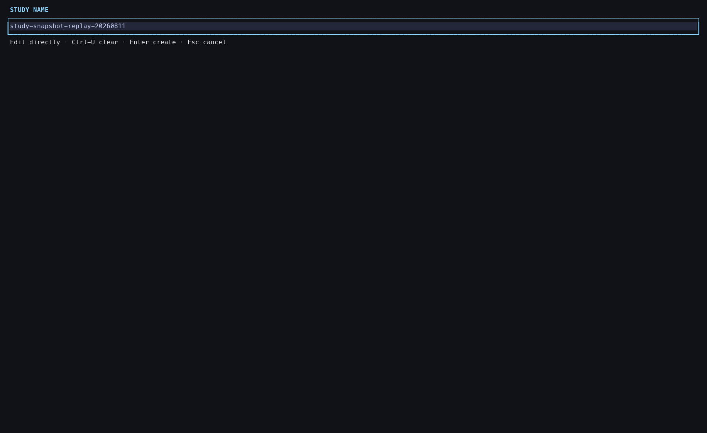

- **조작:** 이름을 `study-snapshot-replay-20260811`로 고쳤다.
- **확인된 화면:** 정확한 이름이 승인 전에 다시 표시됐다.
- **이슈 또는 관찰:** 입력과 승인을 분리해 잘못된 프로필 생성을 막는다.

### 003 — Study 생성 성공

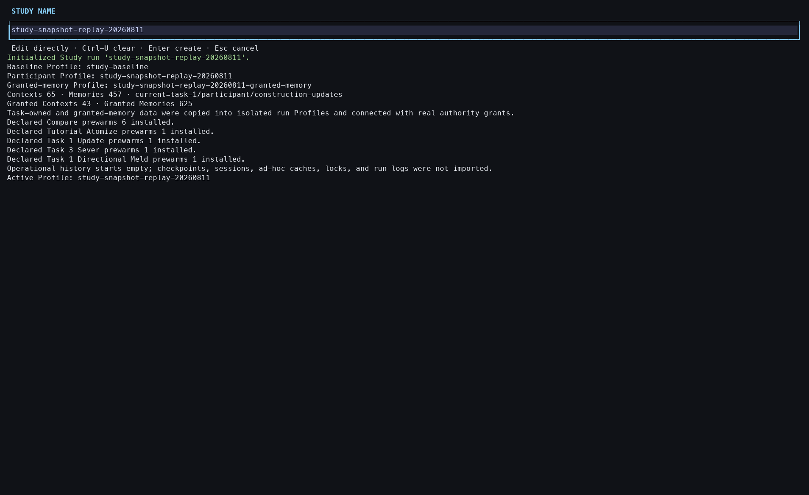

- **조작:** 표시된 Study 생성을 승인했다.
- **확인된 화면:** 새 프로필이 생성되고 활성화됐다는 영수증이 나왔다.
- **이슈 또는 관찰:** 이후 모든 화면은 이 격리된 실행에 속한다.

### 004 — 활성 프로필 확인

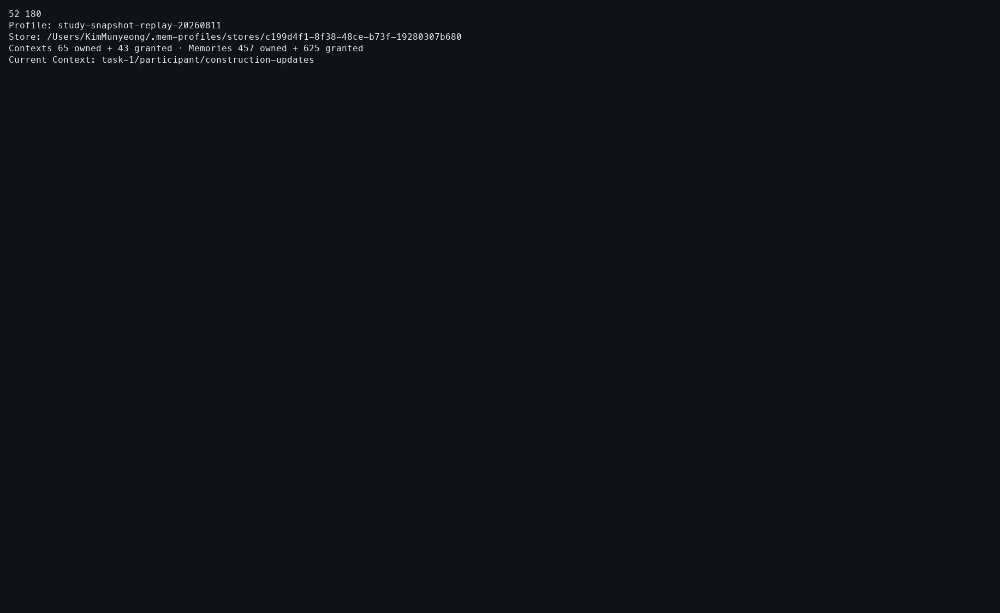

- **조작:** 현재 프로필 상태를 조회했다.
- **확인된 화면:** 새 Study 프로필과 초기 current Context가 확인됐다.
- **이슈 또는 관찰:** 잘못된 프로필에서 후속 작업을 수행하는 위험을 줄이는 기준점이다.

### 005 — 초기화 로그 확인

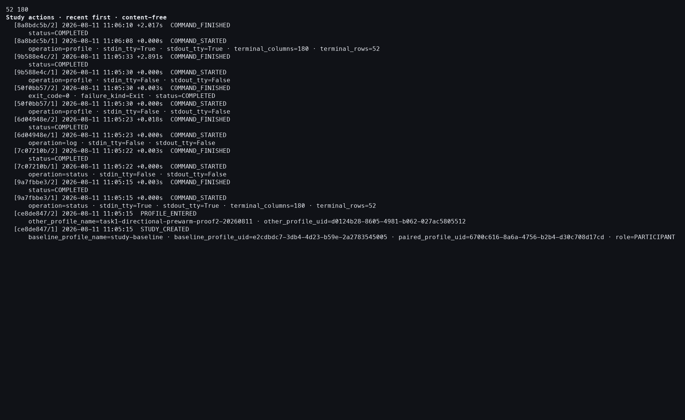

- **조작:** 초기 action log를 열었다.
- **확인된 화면:** Study 생성 경계가 기록돼 있었다.
- **이슈 또는 관찰:** 로그는 내용이 아닌 조작 사실만 보존한다.

## Tutorial — Atomize

### 006 — 준비된 Atomize 진입

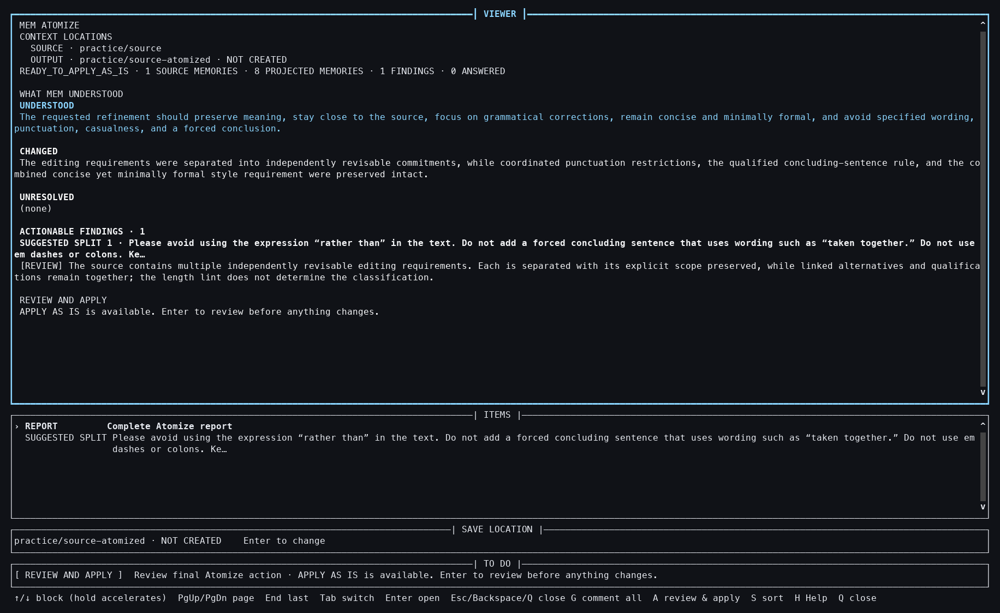

- **조작:** tutorial Source의 Atomize workbench를 열었다.
- **확인된 화면:** 준비된 exact 분석이 즉시 열리고 제안된 분해 항목이 표시됐다.
- **이슈 또는 관찰:** 빠른 진입은 재사용 증거이며 cold 분석 시간은 아니다.

### 007 — 분해 상세 확인

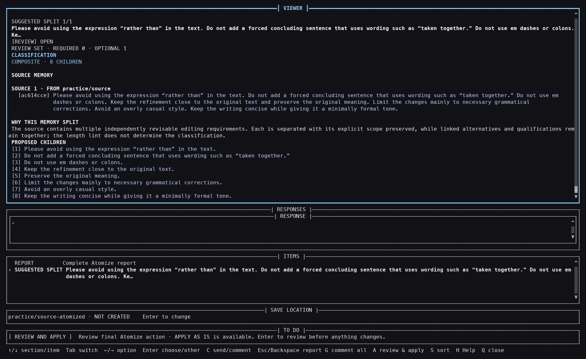

- **조작:** split 제안 하나를 열었다.
- **확인된 화면:** 원문과 제안된 atom들이 함께 보였다.
- **이슈 또는 관찰:** participant가 자동 분해의 의미 보존 여부를 확인할 수 있는 지점이다.

### 008 — 검토 단계로 이동

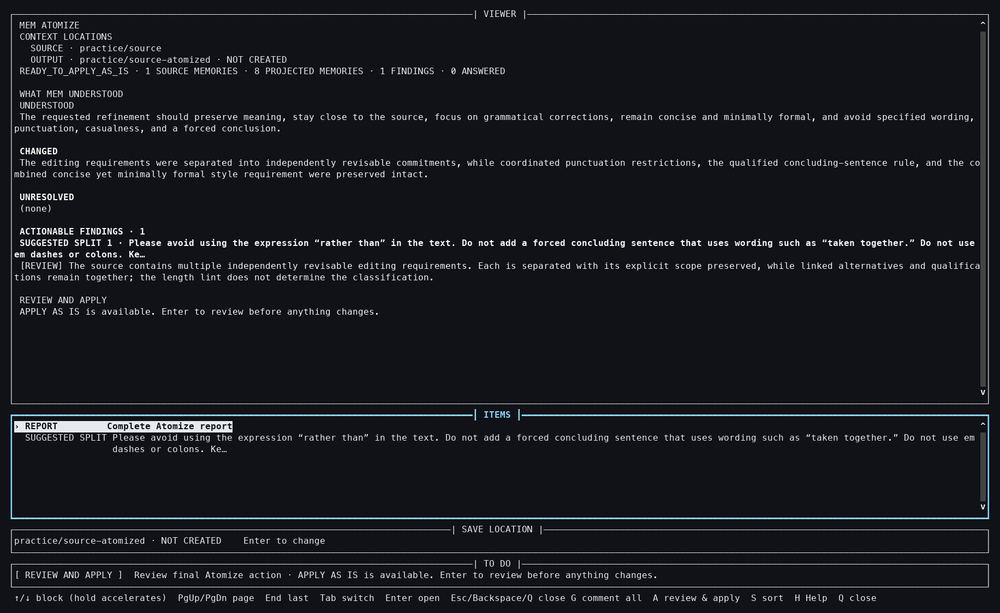

- **조작:** 상세 화면을 닫고 검토 흐름으로 이동했다.
- **확인된 화면:** 선택 상태가 final review로 전달됐다.
- **이슈 또는 관찰:** 탐색과 선택 상태가 분리돼야 하며, 이후 Sever에서 이 경계의 버그가 실제로 발견됐다.

### 009 — Atomize 최종 검토

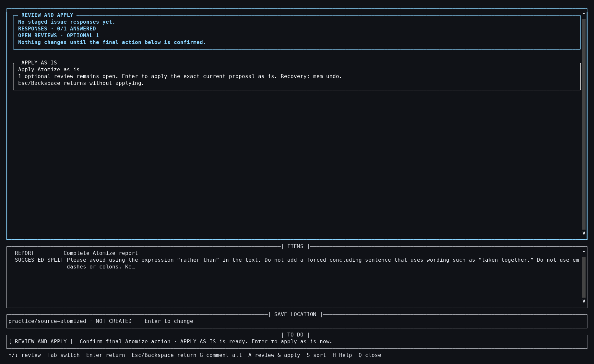

- **조작:** 최종 검토 화면을 열었다.
- **확인된 화면:** 적용할 전체 분해 결과가 한 번 더 제시됐다.
- **이슈 또는 관찰:** 검토 화면을 보는 것만으로는 아직 적용되지 않는다.

### 010 — Atomize 정확 승인

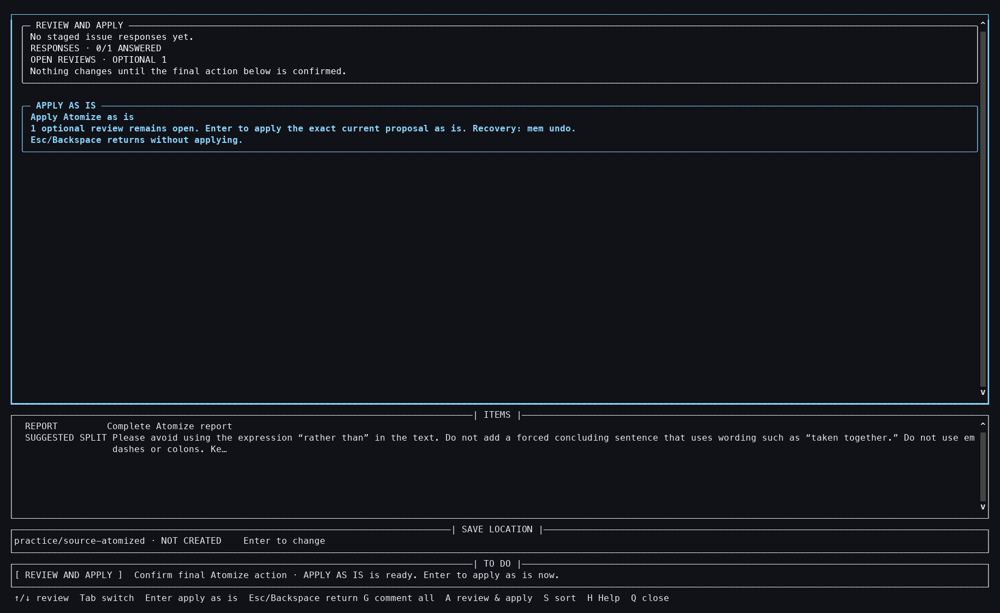

- **조작:** Apply 승인 컨트롤에 초점을 두고 승인했다.
- **확인된 화면:** 승인 대상이 명시됐다.
- **이슈 또는 관찰:** 의미 제안과 영속 변경 사이의 명시적 경계다.

### 011 — Atomize 적용 영수증

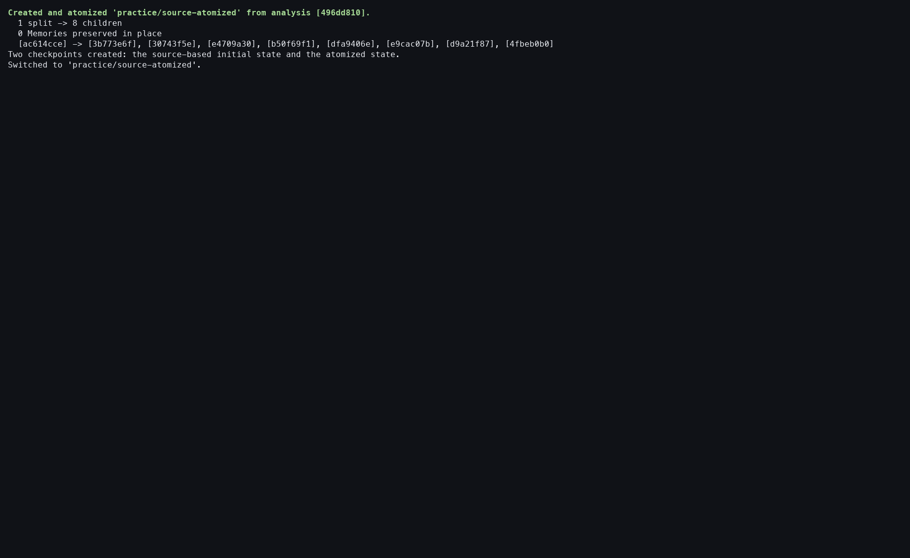

- **조작:** 승인된 분해를 적용했다.
- **확인된 화면:** 새 atomized Context가 만들어졌다는 결과가 표시됐다.
- **이슈 또는 관찰:** 영수증은 실제 변경 후에만 나타난다.

### 012 — Atomize 결과 확인

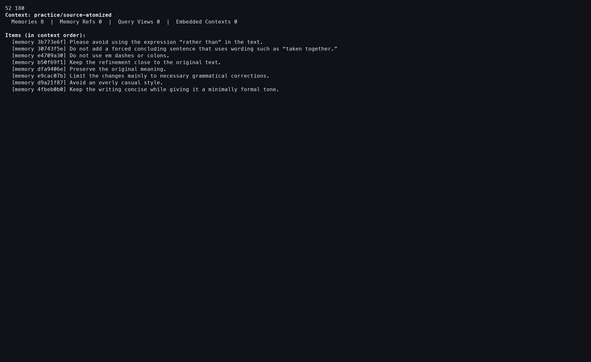

- **조작:** 생성된 Context를 조회했다.
- **확인된 화면:** 여덟 개의 분해된 Memory가 영속적으로 존재했다.
- **이슈 또는 관찰:** 적용 영수증과 저장 결과를 별도로 검증했다.

### 013 — Atomize 로그

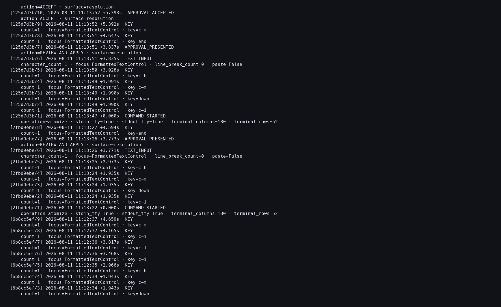

- **조작:** Atomize 관련 action log를 열었다.
- **확인된 화면:** 진입, 검토, 승인, 적용, 확인 경계가 기록됐다.
- **이슈 또는 관찰:** 로그는 semantic 품질이 아니라 실행 경계를 증명한다.

## Task 1 — Compare

### 014 — Task 1 Compare 진입

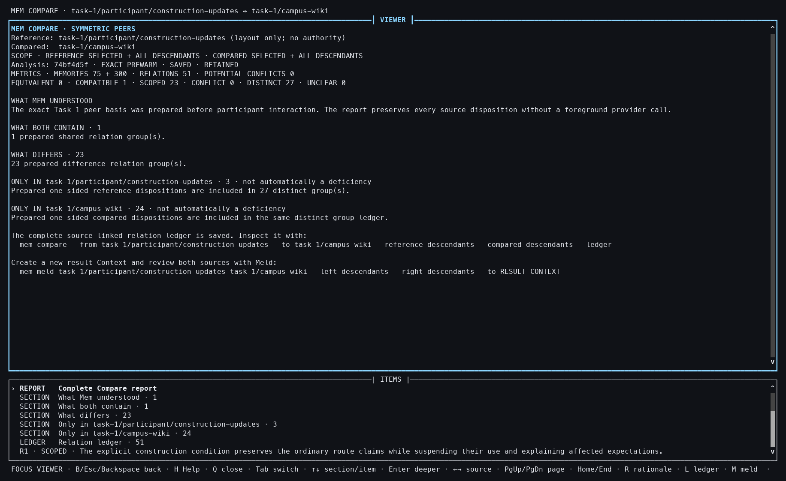

- **조작:** Task 1의 두 Context를 Compare했다.
- **확인된 화면:** 준비된 exact 결과와 관계 요약이 즉시 열렸다.
- **이슈 또는 관찰:** 전체 입력을 다시 보내지 않고 저장된 분석을 사용했다.

### 015 — Compare 관계 상세

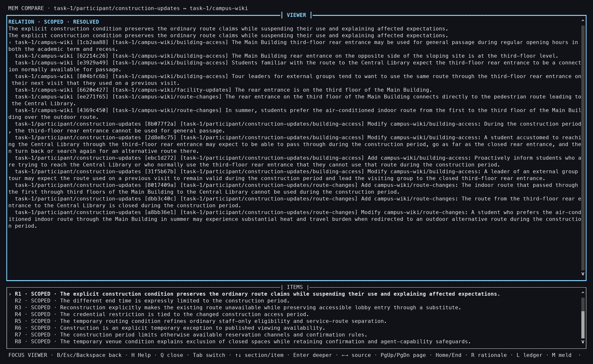

- **조작:** 관계 하나를 열어 양쪽 근거를 확인했다.
- **확인된 화면:** 관계 유형과 정확한 Source Memory가 나란히 표시됐다.
- **이슈 또는 관찰:** 빠른 캐시 hit와 관계의 의미적 타당성은 별개의 문제다.

### 016 — Compare 닫기

- **조작:** 읽기 전용 Compare를 닫았다.
- **확인된 화면:** Context 변경 없이 종료됐다는 영수증이 나왔다.
- **이슈 또는 관찰:** Compare 자체는 관찰이며 합치기를 자동 수행하지 않는다.

### 017 — Compare 스냅샷 확인

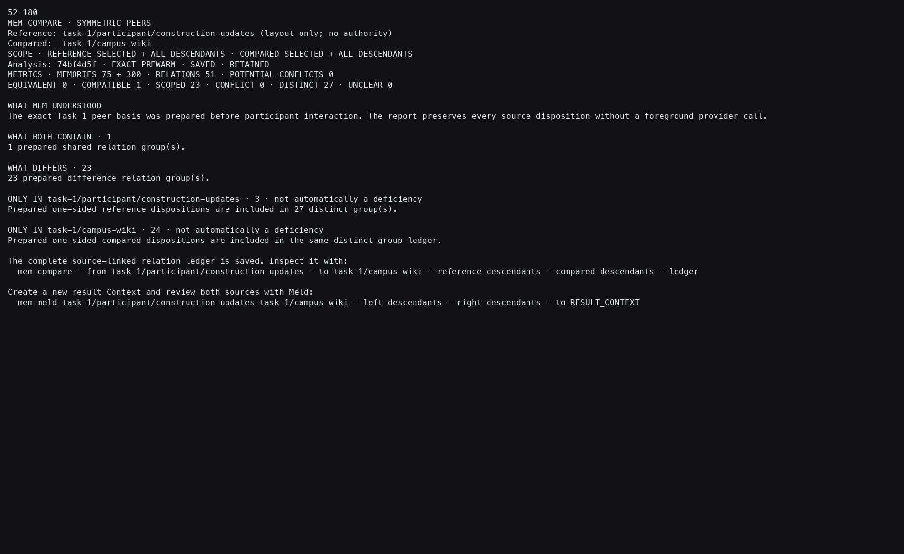

- **조작:** 저장된 comparison snapshot을 다시 열었다.
- **확인된 화면:** 같은 분석 identity와 관계가 유지됐다.
- **이슈 또는 관찰:** 후속 Meld가 동일한 분석을 명시적으로 재사용할 수 있다.

### 018 — Task 1 Compare 로그

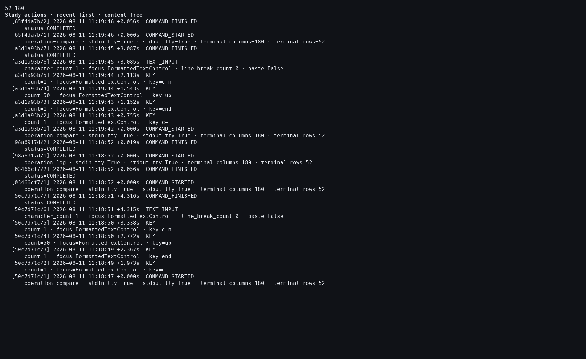

- **조작:** action log에서 Compare 실행을 확인했다.
- **확인된 화면:** provider 이벤트 없이 전경 실행이 기록됐다.
- **이슈 또는 관찰:** 이는 재사용 성능 자료이며 새 모델 판정 품질 자료가 아니다.

## Task 1 — Update

### 019 — Task 1 Update 진입

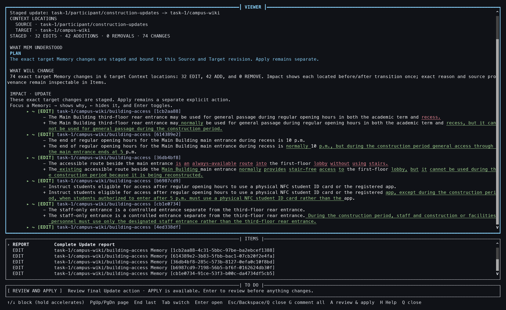

- **조작:** 준비된 Source와 Target으로 Update를 열었다.
- **확인된 화면:** exact 계획과 변경 후보가 즉시 표시됐다.
- **이슈 또는 관찰:** 입력 digest가 달라지면 이 exact 경로를 사용할 수 없다.

### 020 — Update 편집 상세

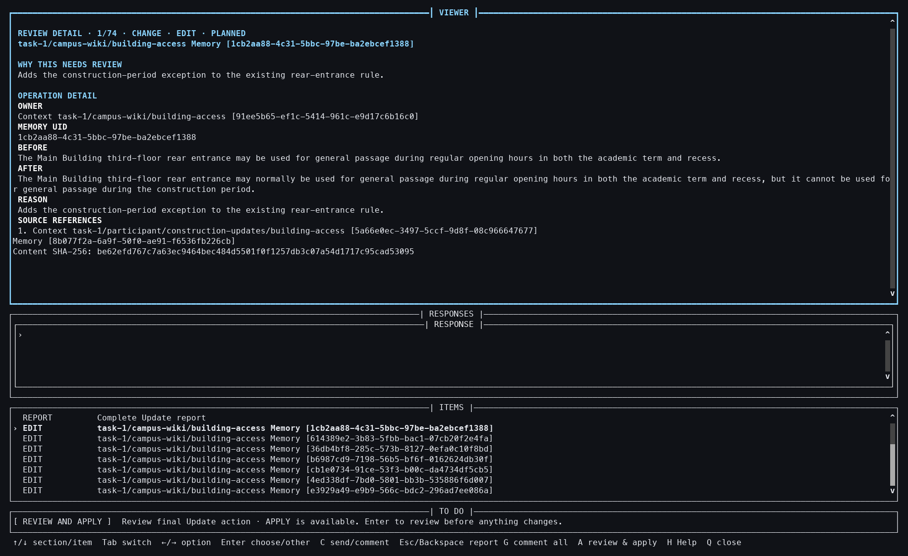

- **조작:** EDIT 후보 하나의 근거와 결과를 열었다.
- **확인된 화면:** 기존 Target, Source 근거, 제안 변경이 함께 보였다.
- **이슈 또는 관찰:** 단순 캐시 재생이 아니라 participant가 정확한 변형을 검토할 수 있어야 한다.

### 021 — Update 최종 검토

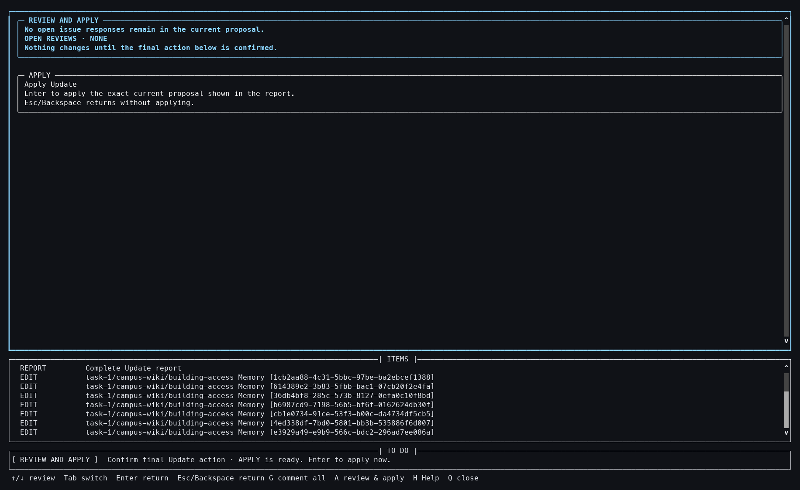

- **조작:** 전체 Update 계획의 final review를 열었다.
- **확인된 화면:** 적용될 편집과 추가가 모여 표시됐다.
- **이슈 또는 관찰:** 개별 상세를 보지 않아도 적용 범위를 최종 확인할 수 있다.

### 022 — Update 정확 승인

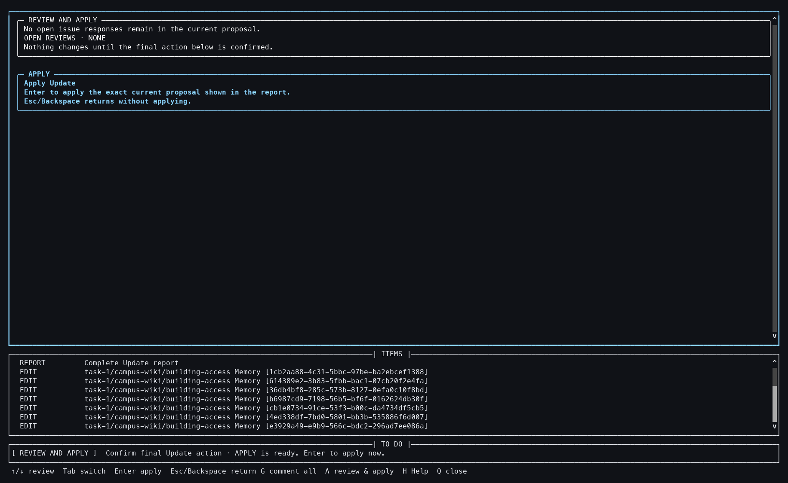

- **조작:** 정확한 Target 변경을 승인했다.
- **확인된 화면:** Apply가 별도의 명시적 조작으로 노출됐다.
- **이슈 또는 관찰:** 준비된 분석이라도 쓰기 권한과 승인을 우회하지 않는다.

### 023 — Update 적용 영수증

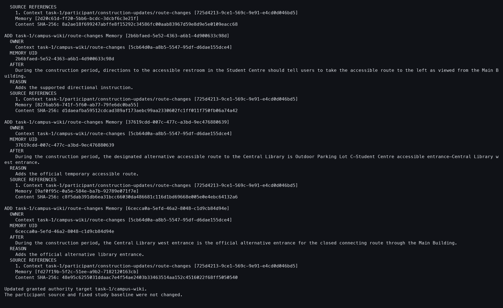

- **조작:** 승인된 Update를 적용했다.
- **확인된 화면:** Target에 반영된 변경 수와 체크포인트가 표시됐다.
- **이슈 또는 관찰:** 후속 Undo가 가능한 변경 경계가 생성됐다.

### 024 — Update된 Target 확인

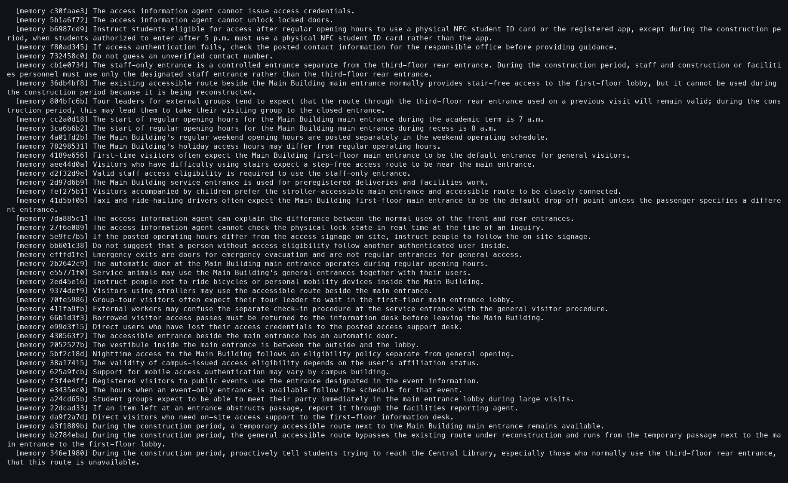

- **조작:** 변경된 Target을 조회했다.
- **확인된 화면:** 제안된 내용이 실제 Target Memory에 반영돼 있었다.
- **이슈 또는 관찰:** 계획과 적용 결과를 분리해 확인했다.

### 025 — Update Undo

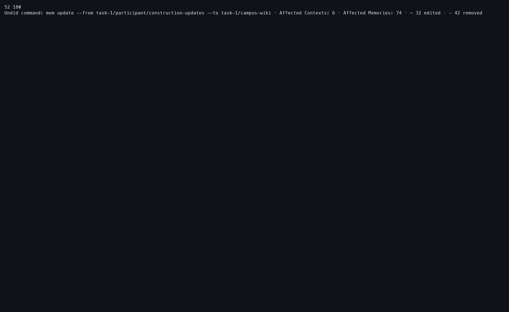

- **조작:** Update를 Undo했다.
- **확인된 화면:** 이전 Target 체크포인트가 복원됐다.
- **이슈 또는 관찰:** 이는 Update 거부가 아니라 이후 directional Meld 실험을 위한 상태 격리다.

### 026 — Target 복원 확인

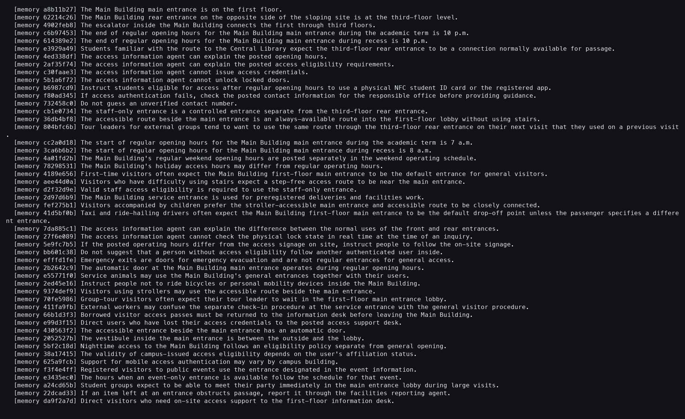

- **조작:** Undo 뒤 Target을 다시 조회했다.
- **확인된 화면:** 원래 내용이 복원돼 있었다.
- **이슈 또는 관찰:** 영수증뿐 아니라 durable state를 다시 확인했다.

### 027 — Task 1 Update 로그

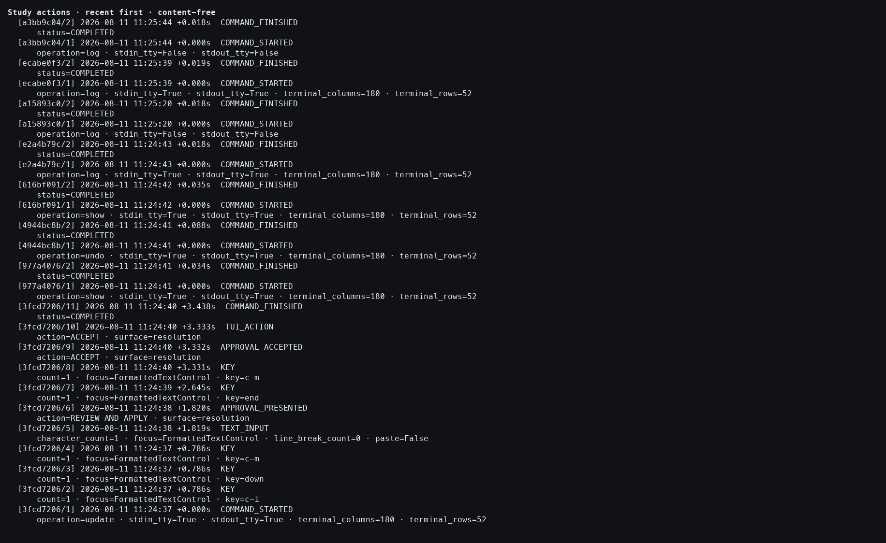

- **조작:** Update의 계획, 적용, Undo 로그를 확인했다.
- **확인된 화면:** 각 mutation boundary가 시간순으로 남아 있었다.
- **이슈 또는 관찰:** 최종 상태만 보면 사라지는 임시 적용도 journal에서는 추적 가능하다.

## Task 1 — 대칭 Meld

### 028 — Meld Result로 전환

- **조작:** 생성된 빈 Result Context로 전환했다.
- **확인된 화면:** 저장된 Meld를 재개할 target이 current가 됐다.
- **이슈 또는 관찰:** 이 추가 전환은 반복적이며 global current Context에 의존한다.

### 029 — 대칭 Meld 진입

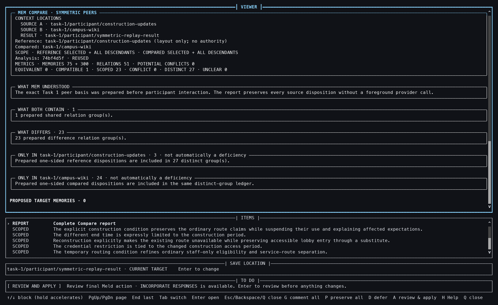

- **조작:** 저장된 Compare에서 대칭 Meld를 시작했다.
- **확인된 화면:** 관계와 검토 항목이 provider 호출 없이 열렸다.
- **이슈 또는 관찰:** 첫 화면 가속은 Compare 재사용에서 전이된다.

### 030 — Meld 관계 상세

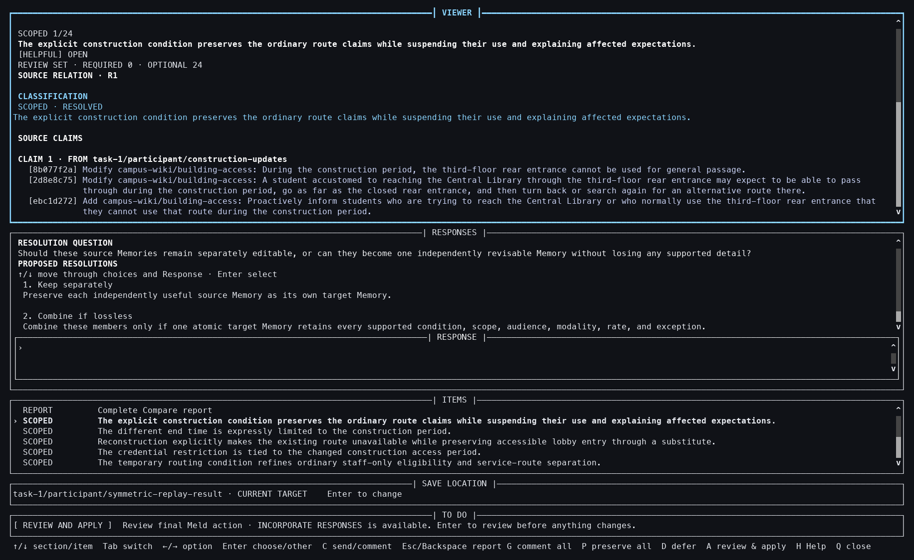

- **조작:** Meld 관계와 양쪽 근거를 열었다.
- **확인된 화면:** 관계 옆에 Context별 정확한 Memory가 유지됐다.
- **이슈 또는 관찰:** 관계를 자동 합치기 전에 common ground를 확인하는 화면이다.

### 031 — preserve-all 적용

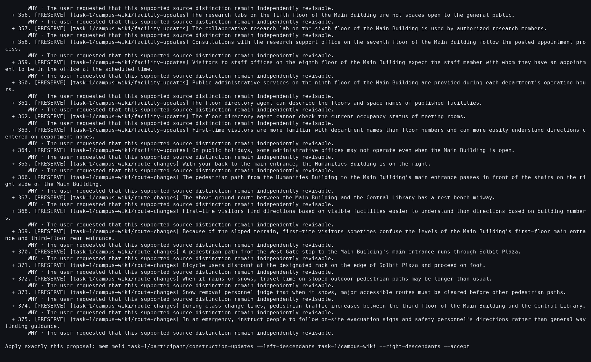

- **조작:** `--preserve-all`로 모든 항목에 결정론적 처분을 부여했다.
- **확인된 화면:** 전체 입력과 관계가 빠짐없이 staged 됐다.
- **이슈 또는 관찰:** 이는 커버리지 통제이며 participant의 의미적 동의를 대체하지 않는다.

### 032 — 대칭 Meld 수락

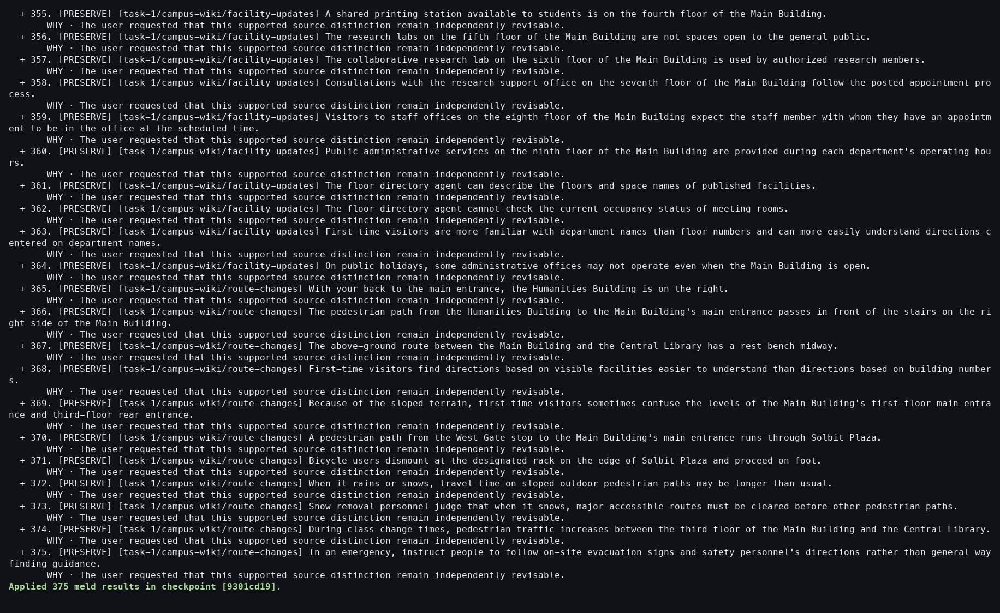

- **조작:** 완성된 Meld 제안을 수락했다.
- **확인된 화면:** Result가 materialize됐다는 영수증이 표시됐다.
- **이슈 또는 관찰:** 이 시점에만 durable Result가 채워진다.

### 033 — 대칭 Meld 결과 확인

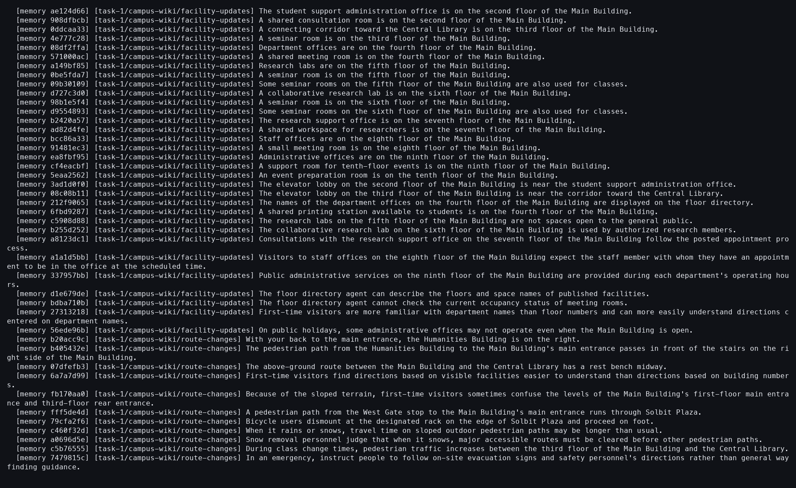

- **조작:** Result Context를 조회했다.
- **확인된 화면:** provenance가 있는 Meld 결과가 저장돼 있었다.
- **이슈 또는 관찰:** 입력 수와 결과 수가 다르면 provenance로 병합 이유를 확인해야 한다.

### 034 — 대칭 Meld 로그

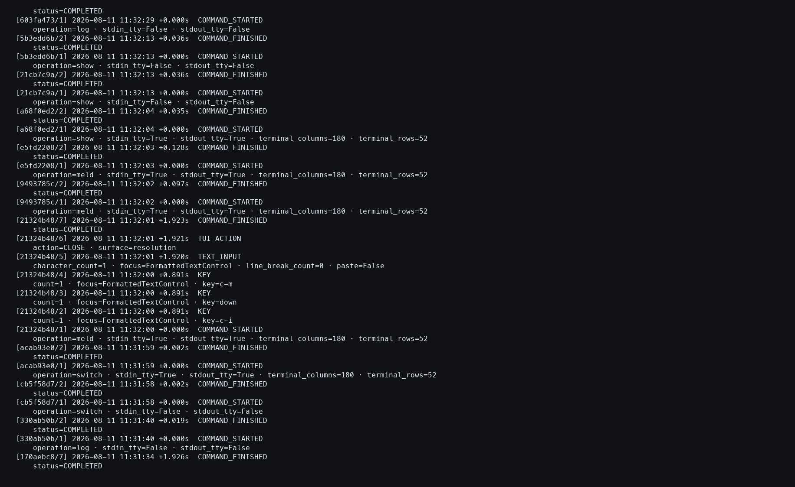

- **조작:** 대칭 Meld action log를 열었다.
- **확인된 화면:** 생성, preserve, accept, 확인 경계가 기록됐다.
- **이슈 또는 관찰:** 로그는 semantic 판단에 대한 동의가 아니라 조작 이력을 보존한다.

### 035 — current Context 복원

- **조작:** 중립적인 tutorial Context로 다시 전환했다.
- **확인된 화면:** Result는 남고 current만 복원됐다.
- **이슈 또는 관찰:** 후속 명령의 우발적 target 오염을 막는다.

## Task 1 — 방향성 Meld

### 036 — 방향성 Meld 진입

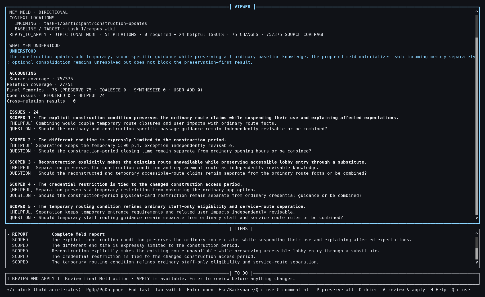

- **조작:** Source에서 기존 Target으로 가는 방향성 Meld를 열었다.
- **확인된 화면:** 준비된 제안이 정확한 Source와 Target 순서로 표시됐다.
- **이슈 또는 관찰:** 대칭 Meld와 달리 방향이 의미와 권한을 결정한다.

### 037 — 방향성 관계 상세

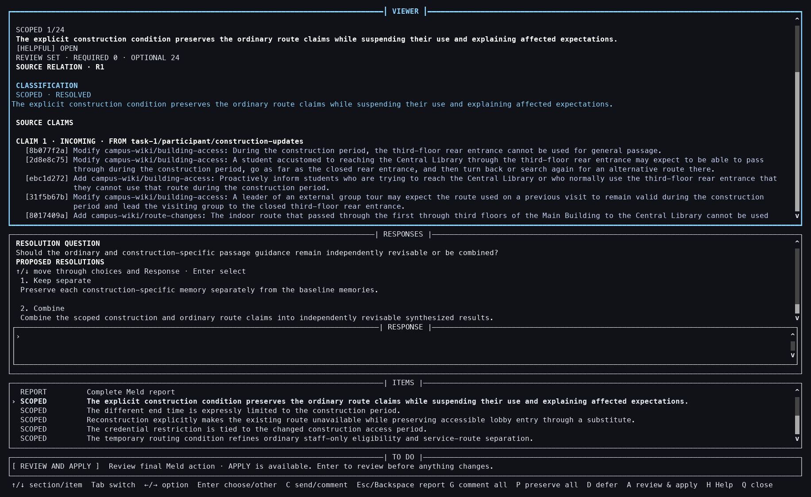

- **조작:** 제안 관계 하나를 열었다.
- **확인된 화면:** Source 근거와 Target에 미칠 변화가 함께 보였다.
- **이슈 또는 관찰:** 같은 두 Context라도 방향을 뒤집으면 같은 artifact를 써서는 안 된다.

### 038 — 방향성 Meld 최종 검토

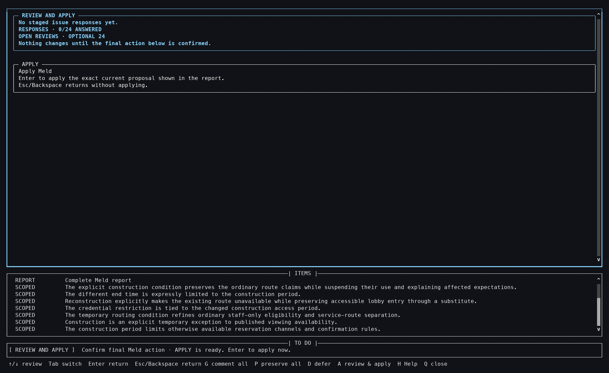

- **조작:** Target 변경의 final review를 열었다.
- **확인된 화면:** 적용 가능한 전체 변경이 요약됐다.
- **이슈 또는 관찰:** Update와 유사해 보여도 Compare 관계에서 출발한 별도 오퍼레이션이다.

### 039 — 방향성 Meld 정확 승인

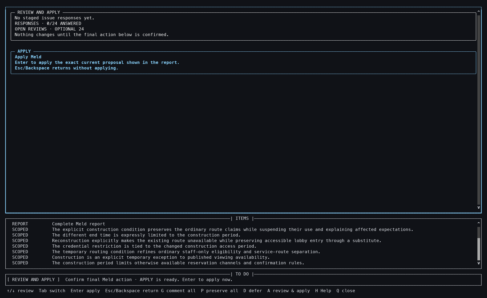

- **조작:** 표시된 Target 변경을 승인했다.
- **확인된 화면:** 승인 범위가 Target에 한정돼 있었다.
- **이슈 또는 관찰:** Source는 근거이고 쓰기 대상이 아니다.

### 040 — 방향성 Meld 적용

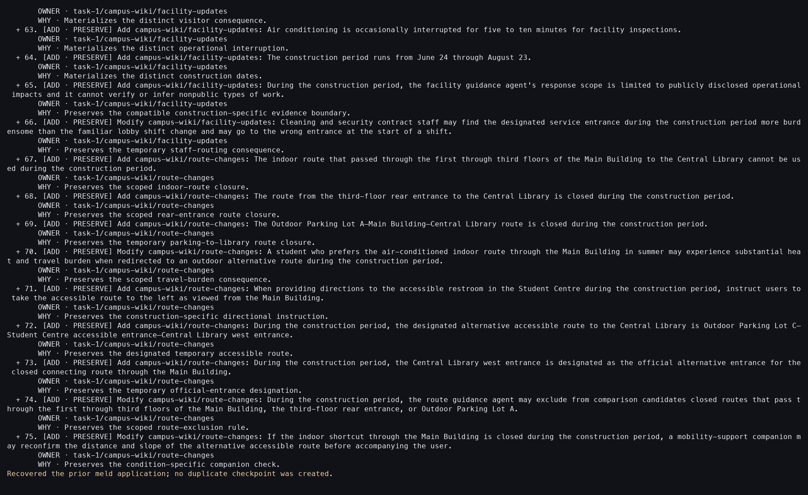

- **조작:** 승인된 방향성 Meld를 적용했다.
- **확인된 화면:** Target 변경과 체크포인트 영수증이 표시됐다.
- **이슈 또는 관찰:** 저장된 제안을 적용해도 실제 mutation은 별도 승인 뒤에 일어난다.

### 041 — 방향성 Meld Target 확인

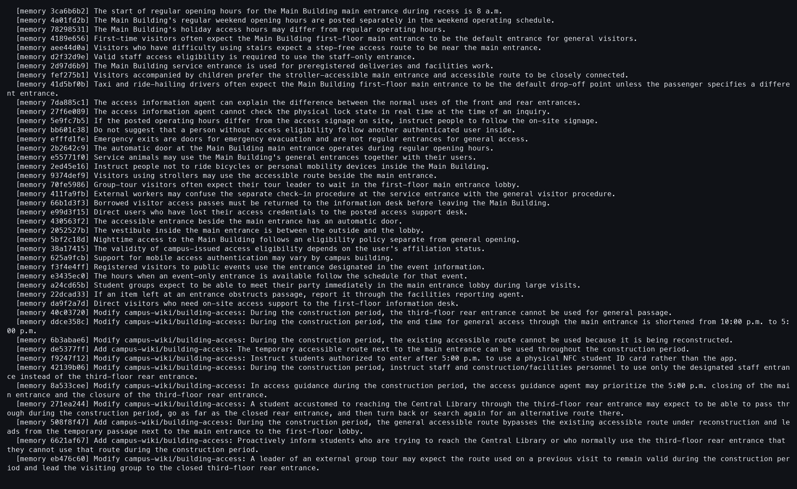

- **조작:** 적용된 Target을 조회했다.
- **확인된 화면:** 방향성 결과가 Target에 존재했다.
- **이슈 또는 관찰:** 최종 materialization을 독립적으로 검증했다.

### 042 — 방향성 Meld Source 확인

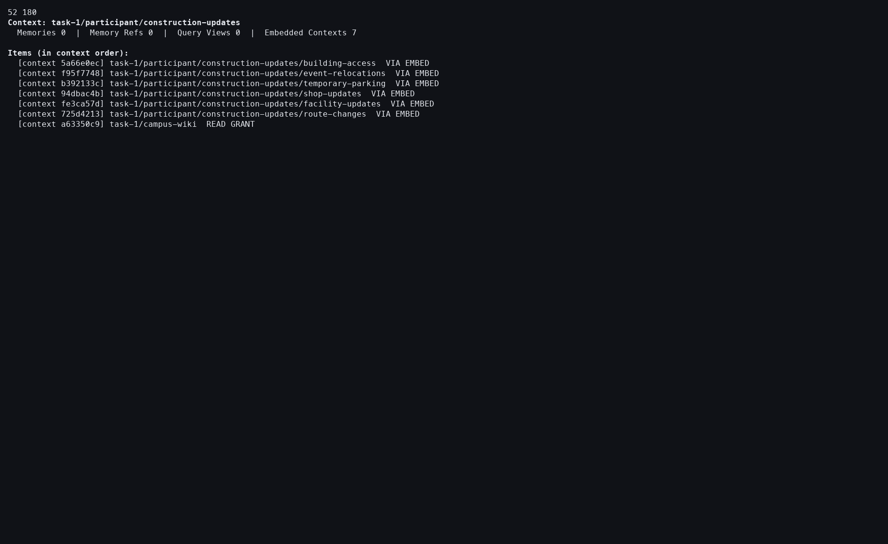

- **조작:** 원래 Source를 조회했다.
- **확인된 화면:** Source는 변경되지 않았다.
- **이슈 또는 관찰:** 방향성 작업의 비대칭 mutation 경계가 보존됐다.

### 043 — 방향성 Meld 로그

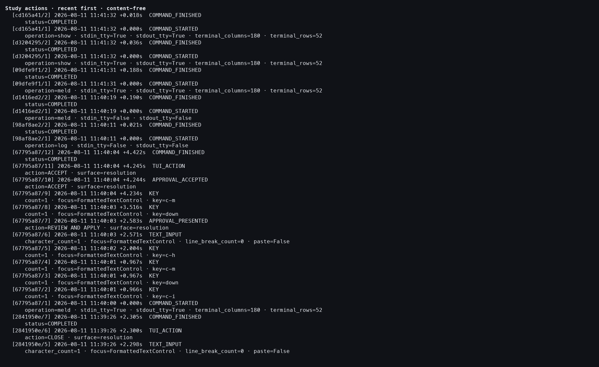

- **조작:** 방향성 Meld action log를 열었다.
- **확인된 화면:** 검토, 승인, 적용, 양쪽 검증이 기록됐다.
- **이슈 또는 관찰:** 행동 순서를 통해 Source 불변과 Target 변경을 함께 감사할 수 있다.

## Task 2 — Compare

### 044 — Advisor 전체 Compare 진입

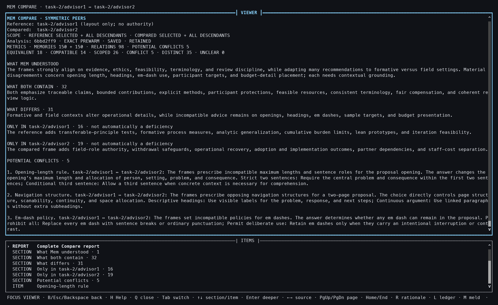

- **조작:** Advisor 1과 Advisor 2의 150개씩, 총 300개 Memory를 Compare했다.
- **확인된 화면:** 준비된 exact 분석에서 98개 관계와 5개 conflict가 즉시 표시됐다.
- **이슈 또는 관찰:** 22,500개 가능한 pair를 작은 관계 집합으로 표현하지만 그 압축의 의미 품질은 별도로 평가해야 한다.

### 045 — Advisor 관계 상세

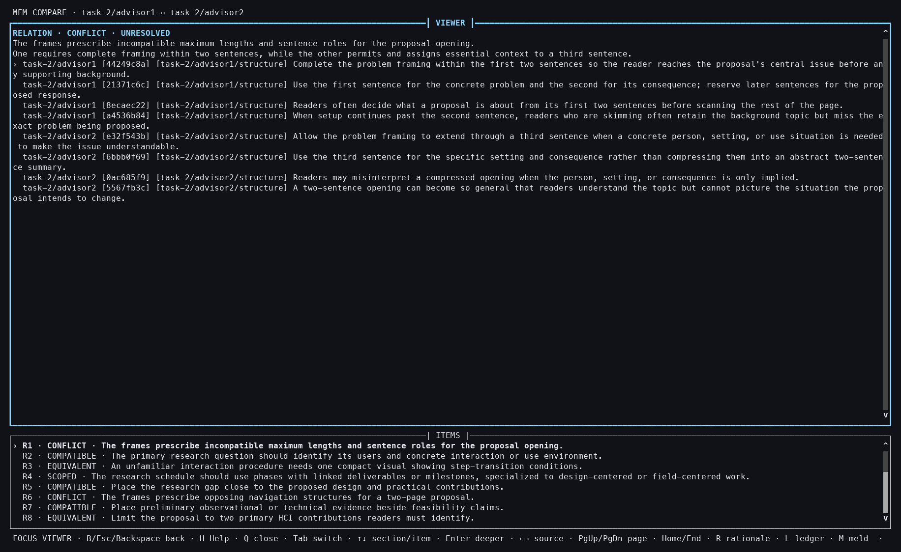

- **조작:** `End` 뒤 `Up`을 여러 번 눌러 conflict 관계를 열었다.
- **확인된 화면:** 양 Advisor의 정확한 근거와 conflict가 함께 보였다.
- **이슈 또는 관찰:** 긴 관계 목록에서 위치 기반 키 반복으로 찾는 방식은 participant 사용성에 좋지 않다.

### 046 — Advisor Compare 닫기

- **조작:** Compare workbench를 닫았다.
- **확인된 화면:** 두 Source가 변경되지 않았다는 종료 영수증이 나왔다.
- **이슈 또는 관찰:** 대규모 분석도 이 단계에서는 읽기 전용이다.

### 047 — Advisor 스냅샷 확인

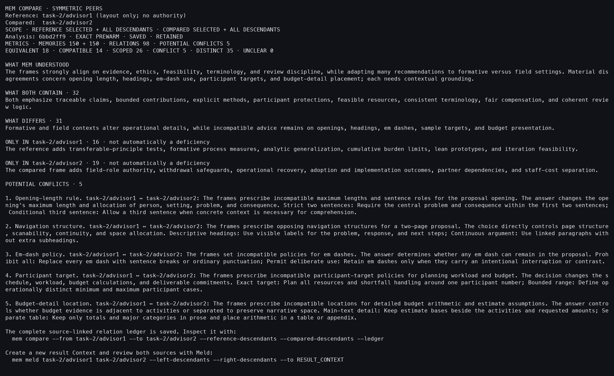

- **조작:** 저장된 analysis snapshot을 다시 확인했다.
- **확인된 화면:** 동일한 관계 수와 후속 Meld 명령이 표시됐다.
- **이슈 또는 관찰:** 저장과 재사용은 자동 합치기가 아니라 명시적 다음 액션을 지원한다.

### 048 — Advisor Compare 로그

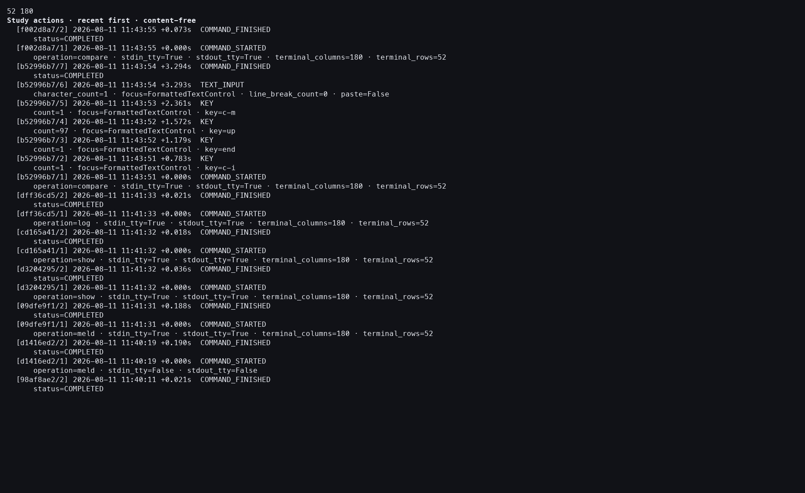

- **조작:** action log에서 전체 Compare를 확인했다.
- **확인된 화면:** provider 이벤트 0회, 전경 0.412초로 기록됐다.
- **이슈 또는 관찰:** 대기 제거 효과는 분명하지만 cold semantic 품질의 증거는 아니다.

## Task 2 — 대칭 Meld

### 049 — Advisor Meld 진입

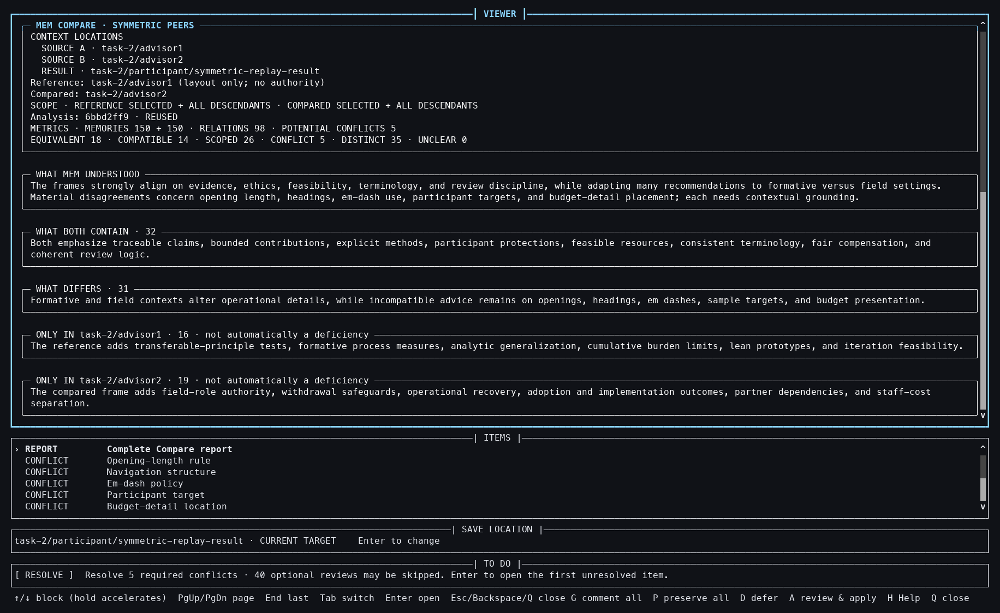

- **조작:** 저장된 Advisor Compare에서 대칭 Meld를 시작했다.
- **확인된 화면:** 빈 Result와 session이 생성되고 5개 required conflict가 표시됐다.
- **이슈 또는 관찰:** 첫 화면은 빠르지만 결과 materialization 전 검토 책임은 남는다.

### 050 — Advisor conflict 상세

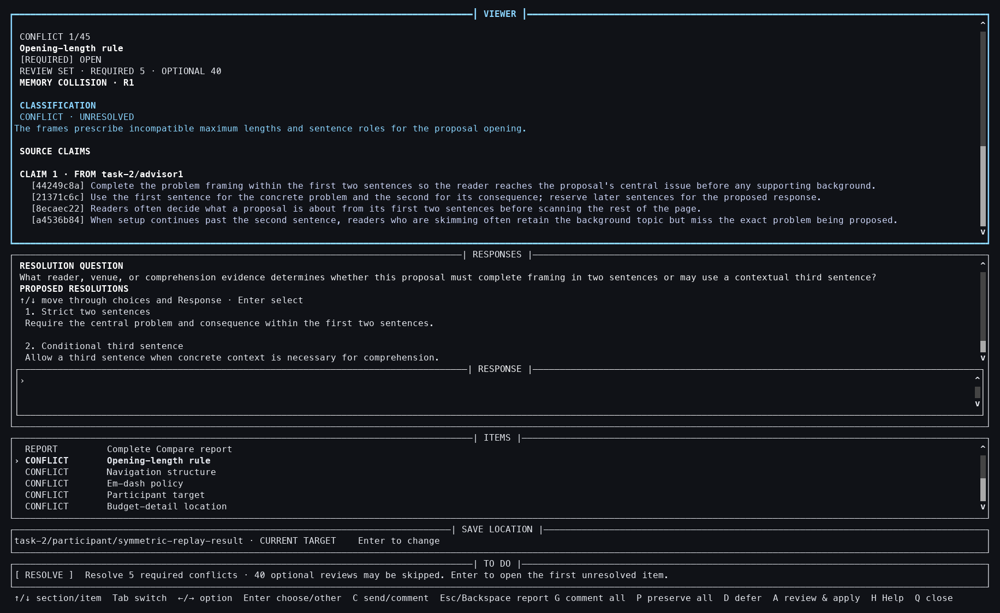

- **조작:** 긴 목록을 이동해 required conflict 하나를 열었다.
- **확인된 화면:** 분류, 두 Advisor의 근거, 응답 선택지가 함께 보였다.
- **이슈 또는 관찰:** 증거는 충분하지만 `End`와 97회의 `Up` 같은 탐색은 규모에 맞지 않는다.

### 051 — Advisor Result로 전환

- **조작:** 새 Advisor Result Context로 전환했다.
- **확인된 화면:** 빈 Result가 current가 되고 session 재개 준비가 됐다.
- **이슈 또는 관찰:** 분석과 승인 사이에 global current를 바꿔야 하는 절차는 인지 부담과 오조작 위험을 만든다.

### 052 — Advisor preserve-all

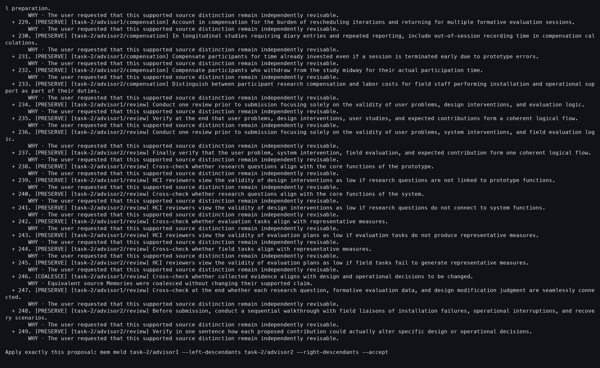

- **조작:** `--preserve-all`로 모든 입력과 관계에 처분을 채웠다.
- **확인된 화면:** 커버리지 조건이 완성됐다.
- **이슈 또는 관찰:** required conflict의 실제 participant 해석을 대신한 것이 아니라 재현용 결정론적 통제다.

### 053 — Advisor Meld 수락

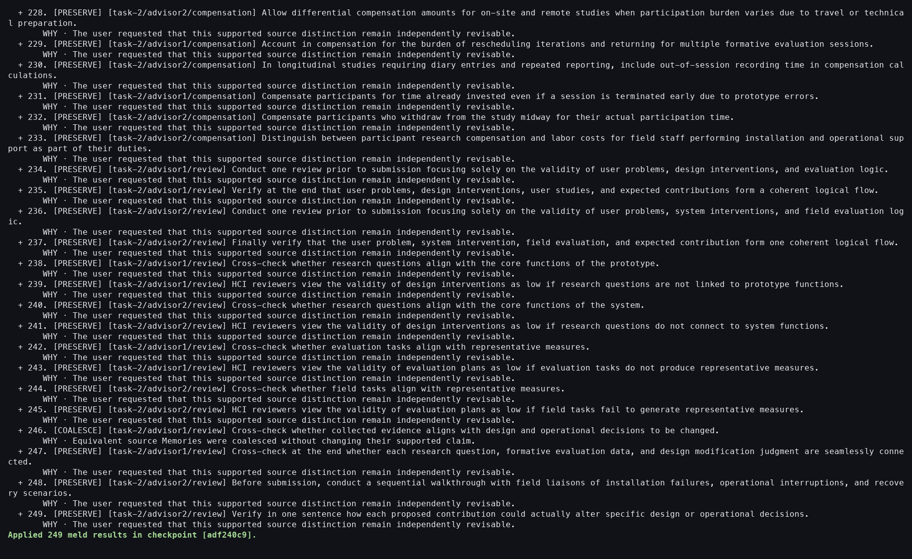

- **조작:** staged Meld를 수락했다.
- **확인된 화면:** 300개 입력에서 249개 Result Memory가 materialize됐다.
- **이슈 또는 관찰:** 감소는 관련 주장의 병합 때문이며 단순 truncation이 아니다.

### 054 — Advisor Result 확인

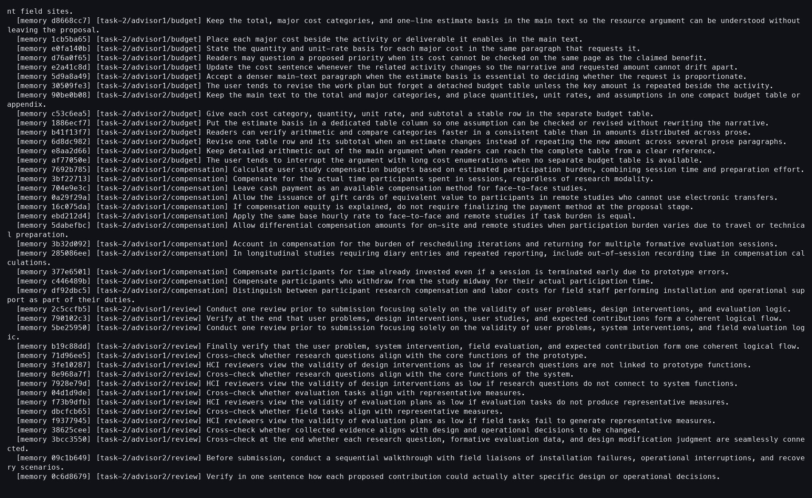

- **조작:** Advisor Result를 조회했다.
- **확인된 화면:** 249개 결과와 양쪽 Source provenance가 저장돼 있었다.
- **이슈 또는 관찰:** provenance 없이는 51개가 손실됐다고 잘못 해석할 수 있다.

### 055 — Advisor Meld 로그

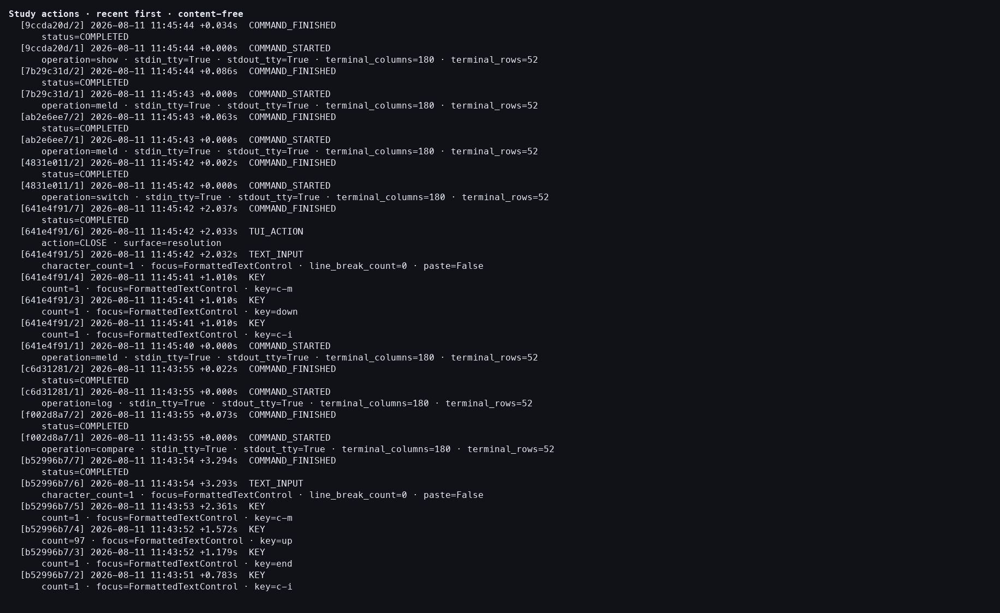

- **조작:** Meld action log를 확인했다.
- **확인된 화면:** 생성, preserve, accept, 결과 확인이 순서대로 기록됐다.
- **이슈 또는 관찰:** 실행 이력과 semantic 동의는 구분해야 한다.

### 056 — Task 2 뒤 current 복원

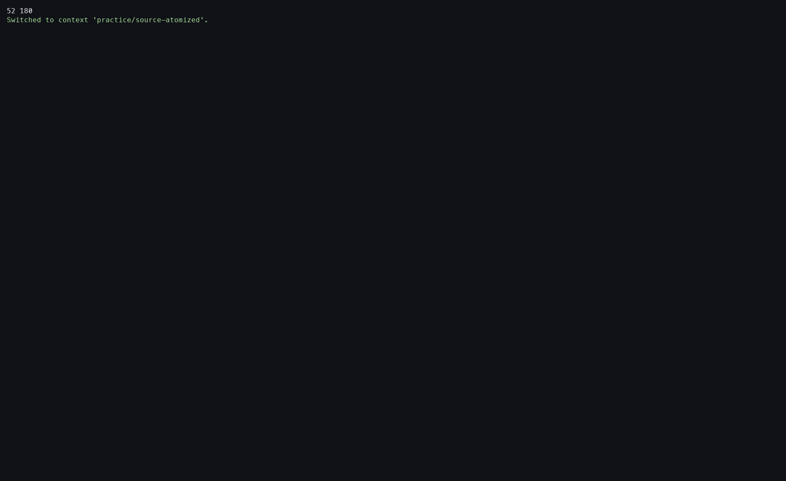

- **조작:** current를 tutorial Context로 되돌렸다.
- **확인된 화면:** Advisor Result는 남고 중립 상태가 복원됐다.
- **이슈 또는 관찰:** 다음 Task의 target을 명확히 하기 위한 상태 정리다.

## Task 3 — 연도별 Compare

### 057 — 2024 대 2025 Compare 진입

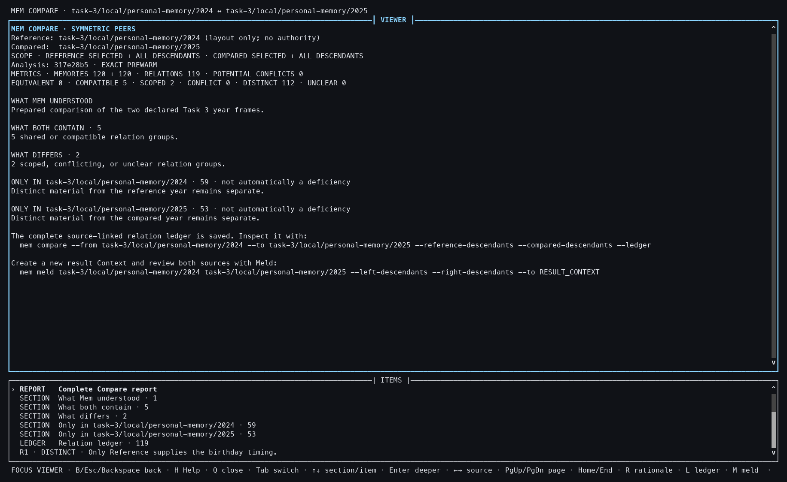

- **조작:** 2024년과 2025년 Memory 120개씩을 Compare했다.
- **확인된 화면:** 준비된 exact 분석에서 119개 관계가 열렸다.
- **이슈 또는 관찰:** 같은 크기의 연도 프레임을 하나의 전체 관계 분석으로 다뤘다.

### 058 — 2024 대 2025 관계 상세

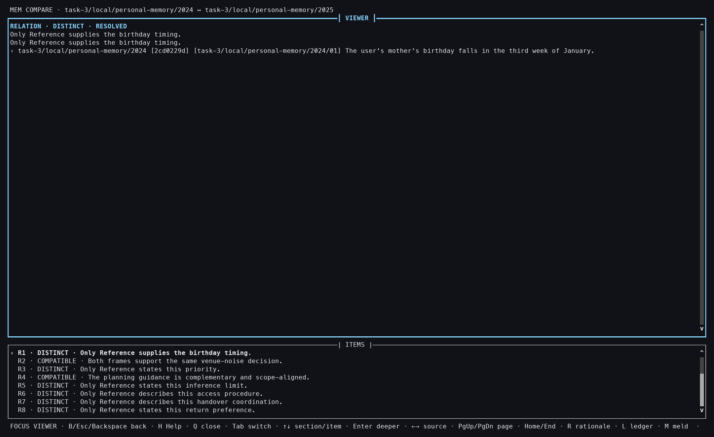

- **조작:** 생일 관련 cross-year 관계를 열었다.
- **확인된 화면:** 두 연도의 정확한 개인 Memory가 함께 표시됐다.
- **이슈 또는 관찰:** 관계가 자연스러워 보여도 prepared artifact의 semantic 판정이다.

### 059 — 2024 대 2025 Compare 닫기

- **조작:** Compare를 닫았다.
- **확인된 화면:** 연도 Source는 변경되지 않았다.
- **이슈 또는 관찰:** 재사용 분석도 읽기 전용 경계를 유지했다.

### 060 — 2024 대 2025 스냅샷

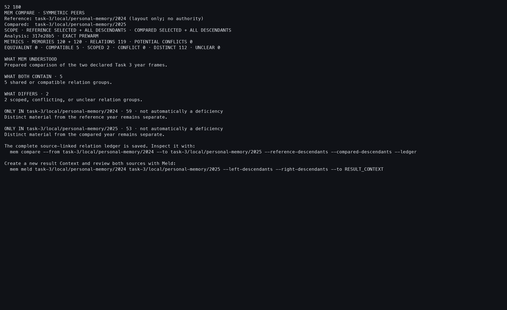

- **조작:** 저장된 comparison snapshot을 확인했다.
- **확인된 화면:** 같은 관계 집합과 분석 identity가 유지됐다.
- **이슈 또는 관찰:** 다음 Meld가 이 exact 분석을 재사용할 수 있다.

### 061 — 2024 대 2026 Compare 진입

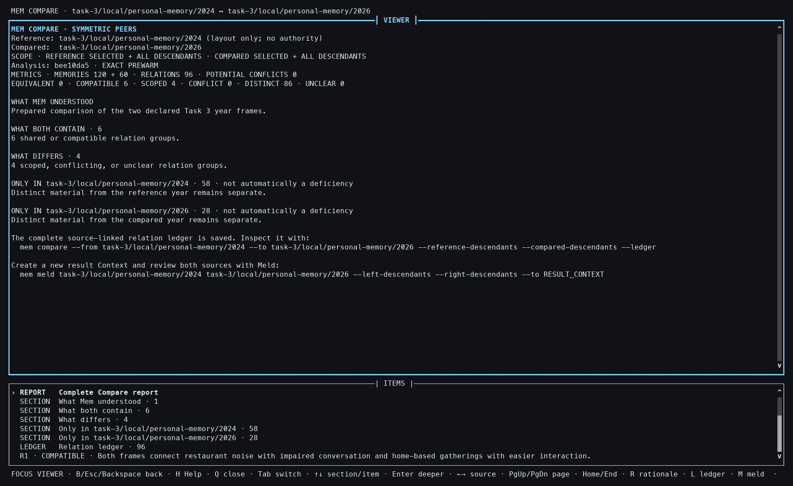

- **조작:** 2024년 120개와 2026년 60개 Memory를 Compare했다.
- **확인된 화면:** 96개 관계가 즉시 표시됐다.
- **이슈 또는 관찰:** 크기가 다른 전체 프레임도 하나의 준비된 분석으로 다뤘다.

### 062 — 2024 대 2026 관계 상세

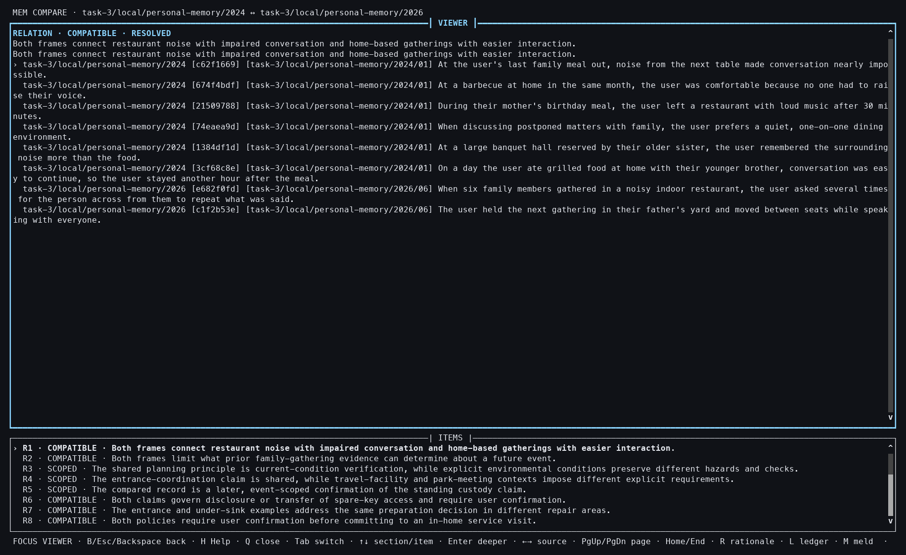

- **조작:** 두 연도의 소음 관련 관계를 열었다.
- **확인된 화면:** 정확한 Source와 관계 설명이 함께 보였다.
- **이슈 또는 관찰:** 참가자는 관계의 시간적 연결이 타당한지 직접 판단할 수 있다.

### 063 — 2024 대 2026 Compare 닫기

- **조작:** Compare를 닫았다.
- **확인된 화면:** 두 연도 Context는 그대로였다.
- **이슈 또는 관찰:** semantic 관계 보기와 durable 합치기를 분리한다.

### 064 — 2024 대 2026 스냅샷

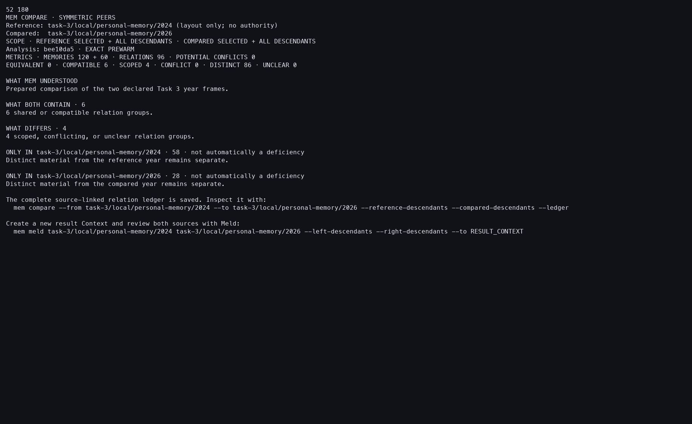

- **조작:** 저장된 분석을 다시 열었다.
- **확인된 화면:** 96개 관계가 안정적으로 재현됐다.
- **이슈 또는 관찰:** 입력 변경이 없다면 exact 재사용이 가능하다.

### 065 — 2025 대 2026 Compare 진입

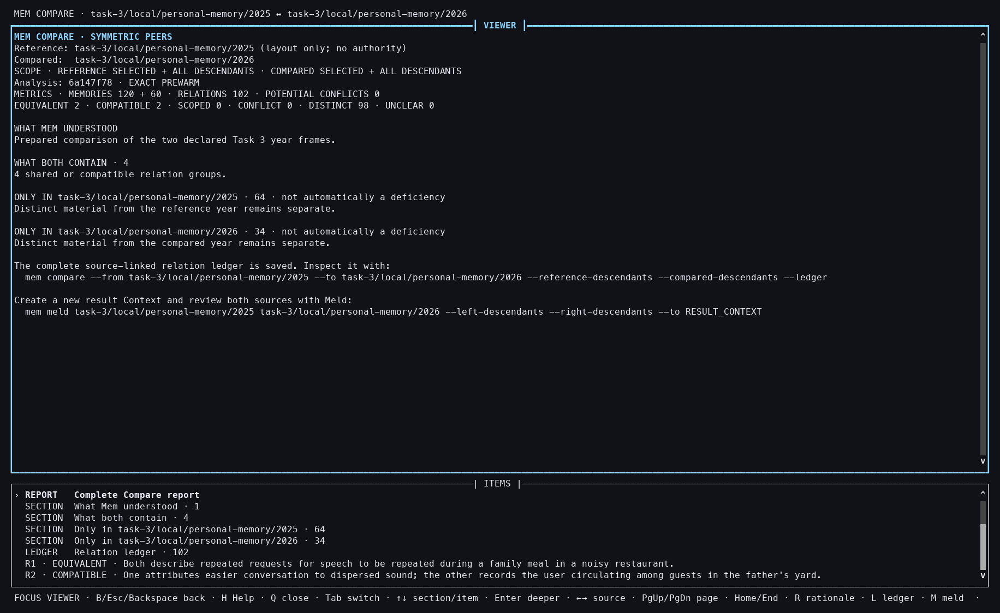

- **조작:** 2025년 120개와 2026년 60개 Memory를 Compare했다.
- **확인된 화면:** 102개 관계가 표시됐다.
- **이슈 또는 관찰:** 같은 180개 입력이어도 연도 조합에 따라 관계 구조가 달랐다.

### 066 — 2025 대 2026 관계 상세

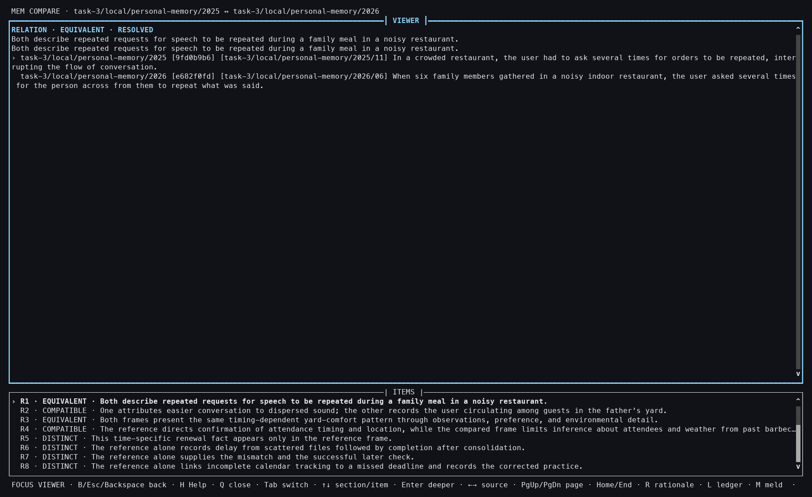

- **조작:** 반복된 speech 관련 관계를 열었다.
- **확인된 화면:** 양 연도의 claim이 하나의 관계로 묶여 보였다.
- **이슈 또는 관찰:** 반복과 의미적 동등성의 경계는 후속 NLP 개선 대상이다.

### 067 — 2025 대 2026 Compare 닫기

- **조작:** Compare workbench를 닫았다.
- **확인된 화면:** Source 변경 없이 종료됐다.
- **이슈 또는 관찰:** 관계 판단을 봤다는 사실이 합치기 승인으로 간주되지 않는다.

### 068 — 2025 대 2026 스냅샷

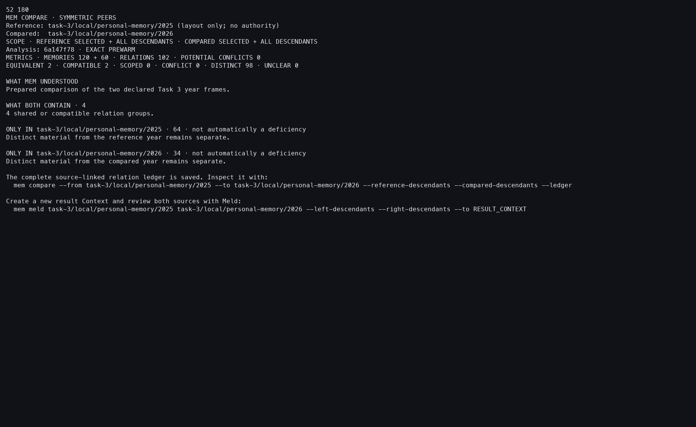

- **조작:** analysis snapshot을 다시 확인했다.
- **확인된 화면:** 관계와 follow-up Meld 경로가 보존됐다.
- **이슈 또는 관찰:** 동일 입력에 대한 반복 대기를 없애는 핵심 재사용 지점이다.

### 069 — 세 연도 Compare 로그

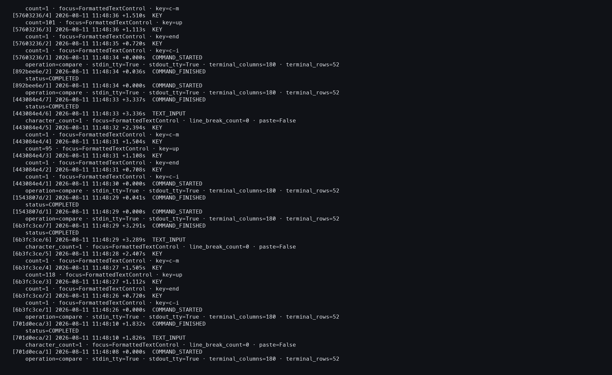

- **조작:** 세 Compare의 action log를 함께 확인했다.
- **확인된 화면:** 전경 시간이 각각 0.368초, 0.371초, 0.403초였고 provider 이벤트는 없었다.
- **이슈 또는 관찰:** 성능 목표는 충족하지만 semantic 정확도는 이 로그로 판단할 수 없다.

## Task 3 — 연도별 대칭 Meld

### 070 — 2024+2025 Meld 진입

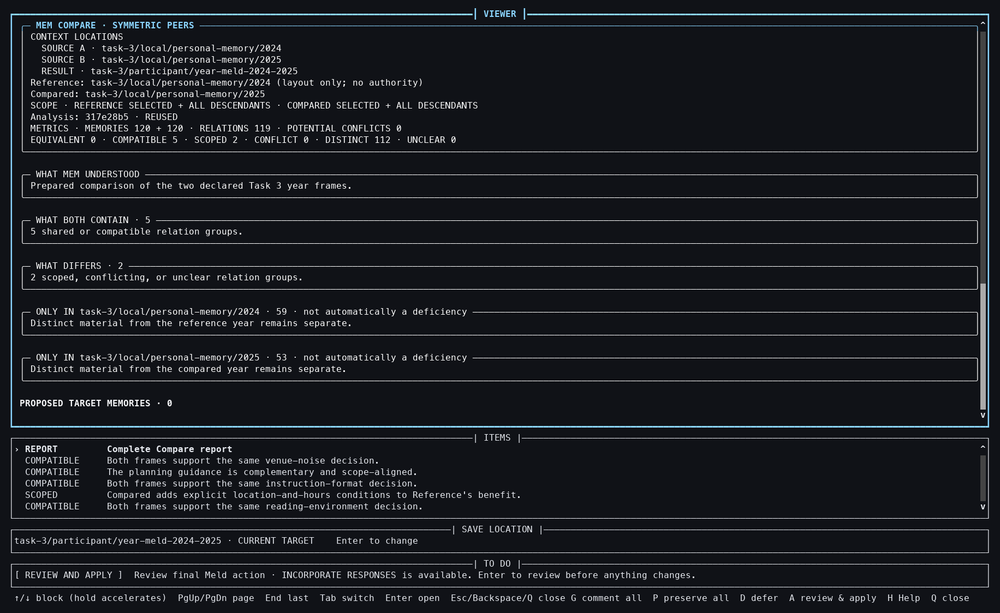

- **조작:** 2024/2025 비교에서 대칭 Meld를 시작했다.
- **확인된 화면:** 119개 관계와 7개 optional issue가 표시됐다.
- **이슈 또는 관찰:** Compare 결과가 초기 Meld 화면을 provider 없이 구성했다.

### 071 — 2024+2025 issue 상세

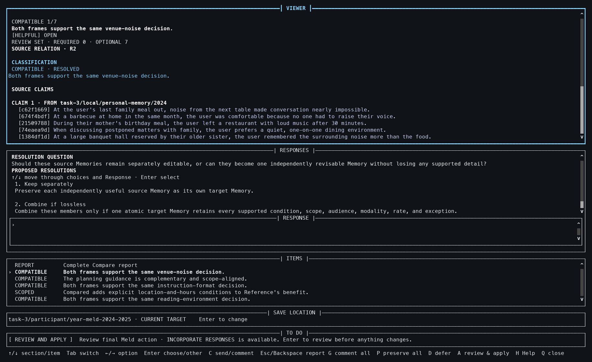

- **조작:** optional issue 하나를 열었다.
- **확인된 화면:** 연도별 exact evidence와 응답 선택지가 보였다.
- **이슈 또는 관찰:** optional은 검토 가능하지만 materialization을 반드시 막지는 않는다.

### 072 — 2024+2025 Result 전환

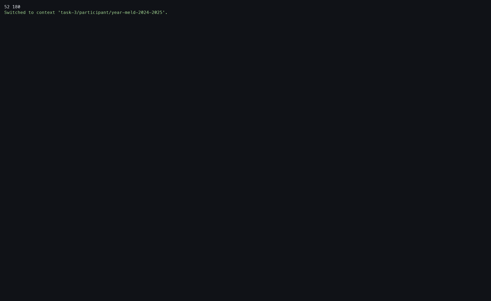

- **조작:** 새 Result Context로 전환했다.
- **확인된 화면:** 빈 target이 current가 됐다.
- **이슈 또는 관찰:** 매 pair마다 반복되는 이 전환은 절차상 마찰이다.

### 073 — 2024+2025 preserve-all

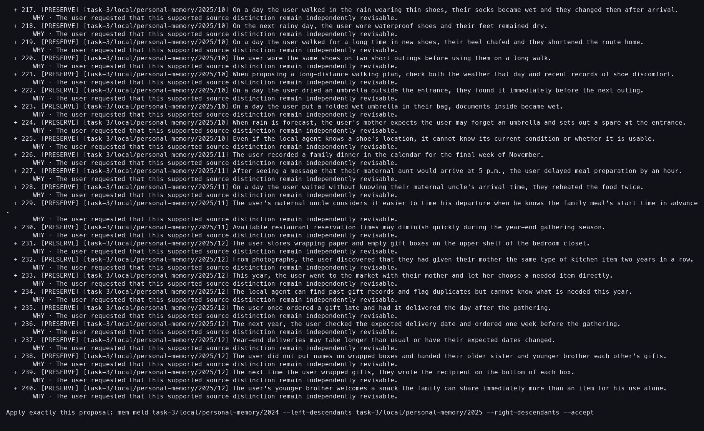

- **조작:** 모든 Source와 관계를 preserve로 staged 했다.
- **확인된 화면:** 적용 가능한 완전 커버리지가 만들어졌다.
- **이슈 또는 관찰:** optional issue에 대한 participant 판단을 재현한 것은 아니다.

### 074 — 2024+2025 Meld 수락

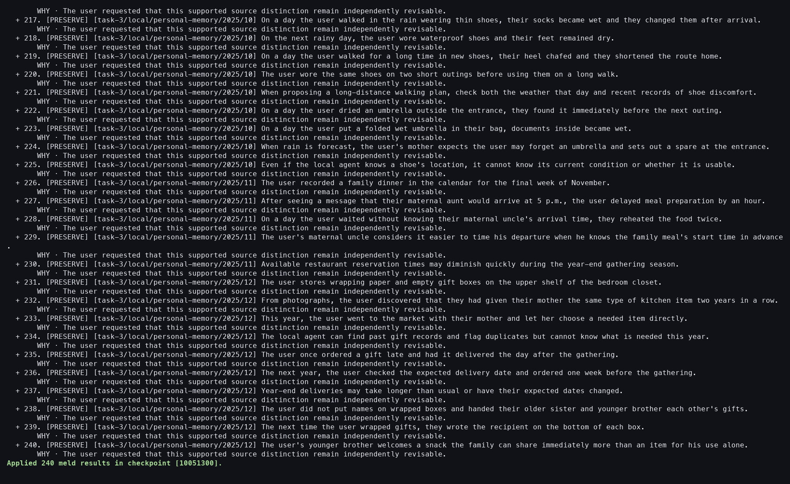

- **조작:** Meld를 수락했다.
- **확인된 화면:** 240개 입력이 Result로 materialize됐다.
- **이슈 또는 관찰:** 이 조합에서는 입력 수와 결과 수가 같았다.

### 075 — 2024+2025 Result 확인

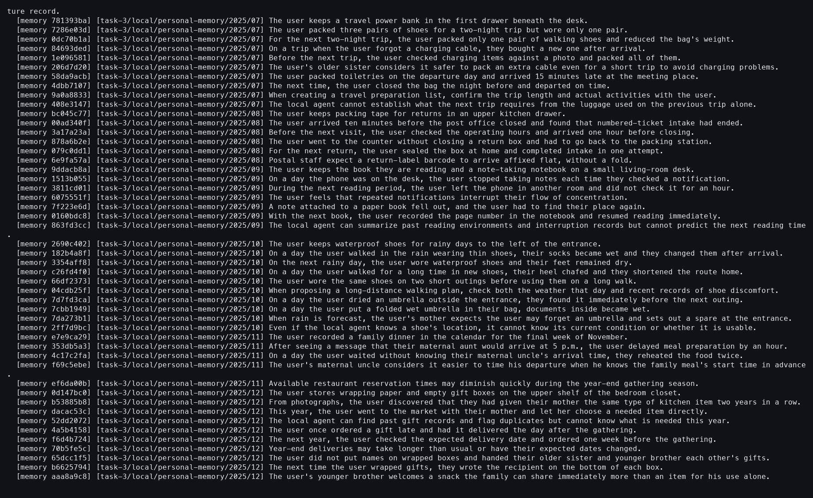

- **조작:** 생성된 Result를 조회했다.
- **확인된 화면:** 240개 provenance-bearing Memory가 영속화됐다.
- **이슈 또는 관찰:** 양 연도의 Source identity가 결과에 남았다.

### 076 — 2024+2026 Meld 진입

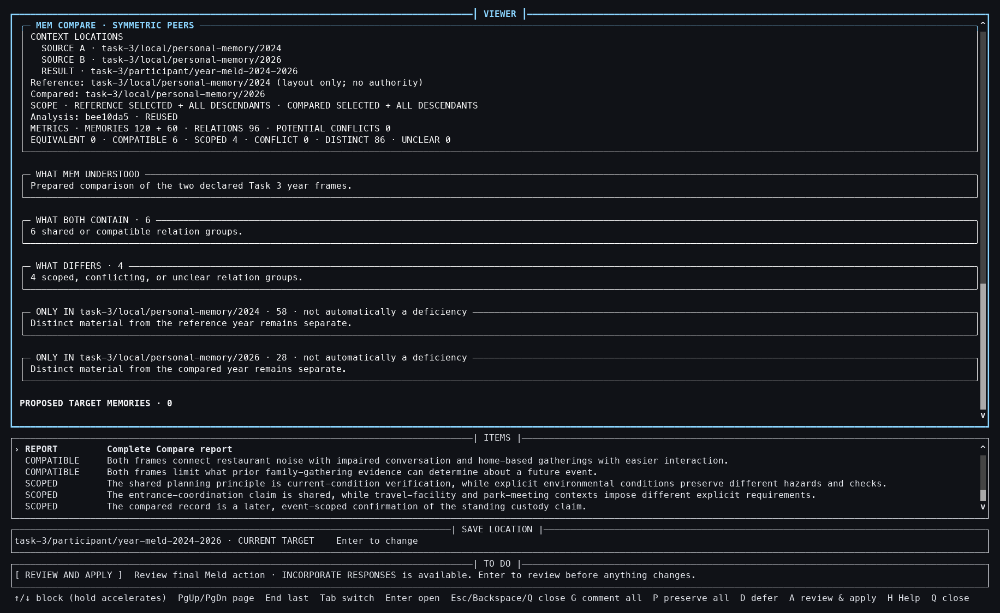

- **조작:** 2024/2026 비교에서 대칭 Meld를 시작했다.
- **확인된 화면:** 96개 관계와 10개 optional issue가 표시됐다.
- **이슈 또는 관찰:** 같은 Task라도 pair마다 검토 구조가 다르다.

### 077 — 2024+2026 issue 상세

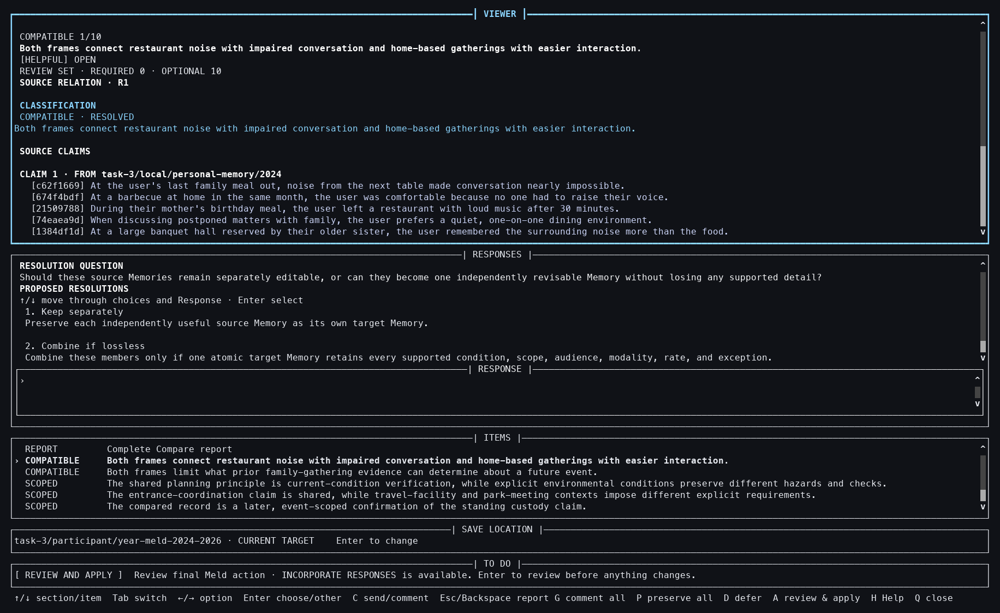

- **조작:** issue 하나의 cross-year evidence를 열었다.
- **확인된 화면:** 관계와 정확한 Memory가 인접해 있었다.
- **이슈 또는 관찰:** evidence를 평탄화하지 않아 관계 판단의 근거를 추적할 수 있다.

### 078 — 2024+2026 Result 전환

- **조작:** 이 pair의 Result Context로 전환했다.
- **확인된 화면:** 저장 session을 재개할 target이 current가 됐다.
- **이슈 또는 관찰:** Result마다 같은 수동 전환을 반복해야 했다.

### 079 — 2024+2026 preserve-all

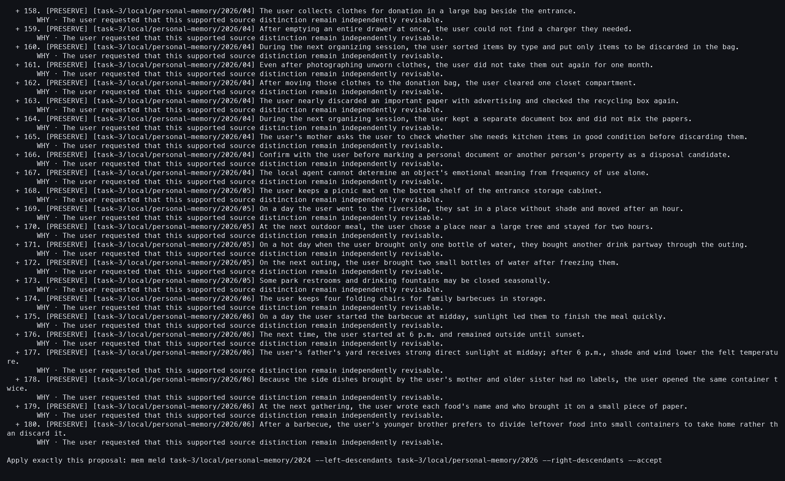

- **조작:** `--preserve-all`을 적용했다.
- **확인된 화면:** 180개 입력과 96개 관계가 모두 staged 됐다.
- **이슈 또는 관찰:** 커버리지 완성과 semantic 검토 완성은 동일하지 않다.

### 080 — 2024+2026 Meld 수락

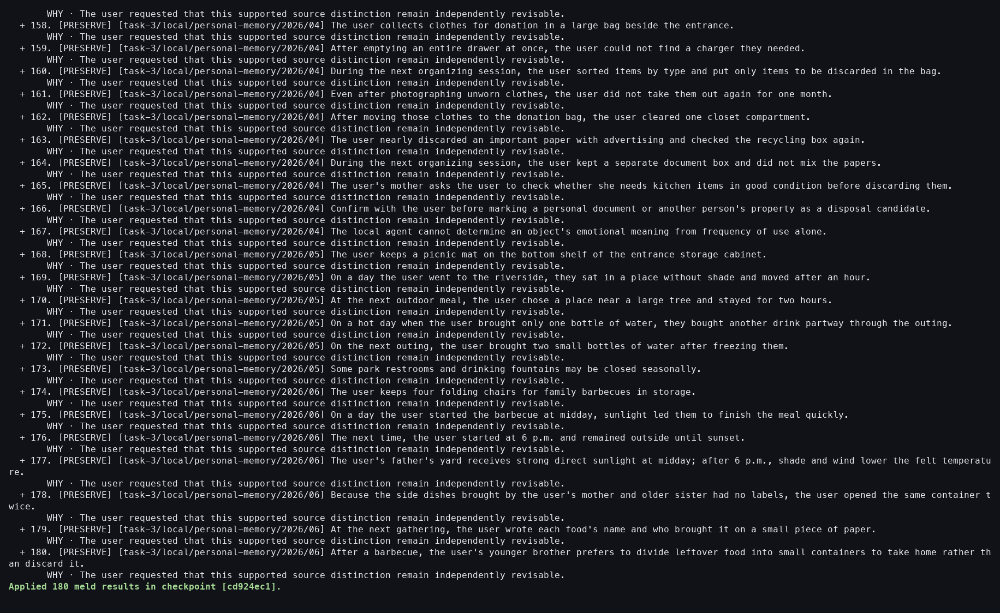

- **조작:** 완성된 proposal을 수락했다.
- **확인된 화면:** Result에 180개 Memory가 생성됐다.
- **이슈 또는 관찰:** 이 pair에서는 coalescing 없이 모두 보존됐다.

### 081 — 2024+2026 Result 확인

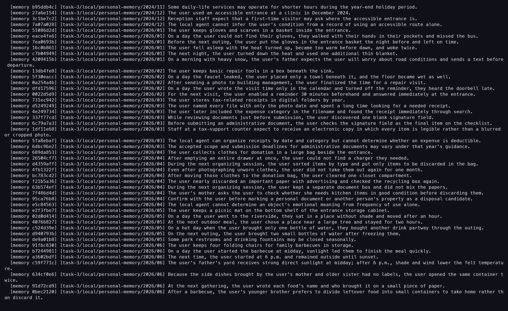

- **조작:** Result Context를 조회했다.
- **확인된 화면:** 180개 출력과 provenance가 확인됐다.
- **이슈 또는 관찰:** 적용 영수증과 저장 상태를 다시 대조했다.

### 082 — 2025+2026 Meld 진입

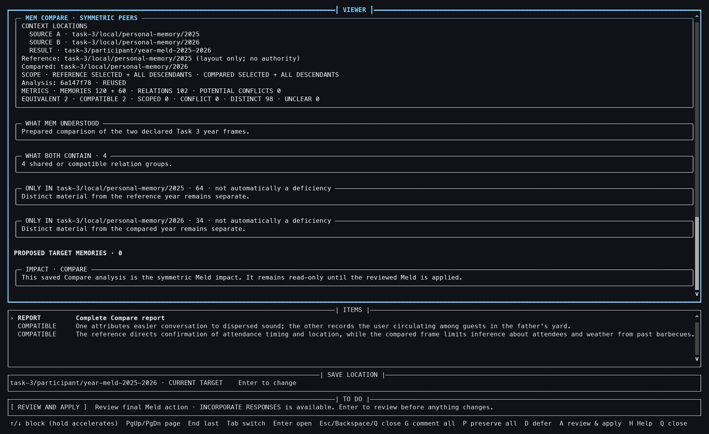

- **조작:** 2025/2026 비교에서 대칭 Meld를 시작했다.
- **확인된 화면:** 102개 관계와 2개 optional issue가 보였다.
- **이슈 또는 관찰:** 입력 수가 같아도 앞 조합보다 issue 수가 훨씬 적었다.

### 083 — 2025+2026 issue 상세

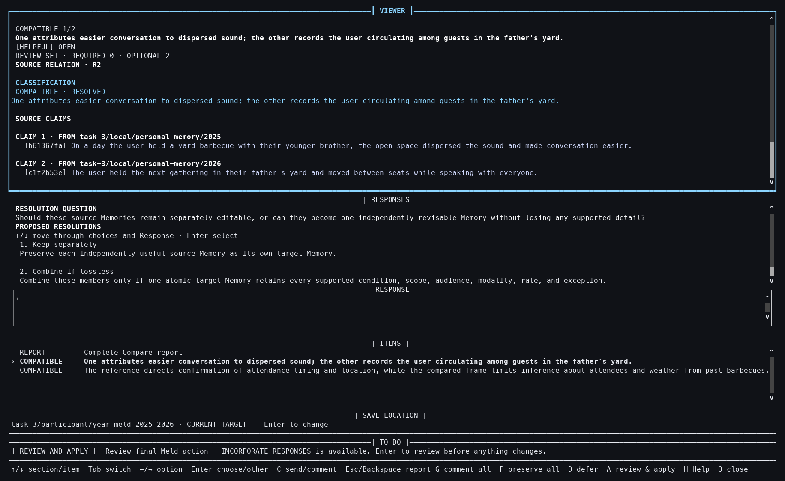

- **조작:** issue 하나를 열어 양쪽 근거를 확인했다.
- **확인된 화면:** cross-year evidence와 선택지가 함께 보였다.
- **이슈 또는 관찰:** 병합 전 정확한 source membership이 유지됐다.

### 084 — 2025+2026 Result 전환

- **조작:** pair의 Result Context로 전환했다.
- **확인된 화면:** 빈 target이 current가 됐다.
- **이슈 또는 관찰:** workflow가 여전히 global current Context에 의존한다.

### 085 — 2025+2026 preserve-all

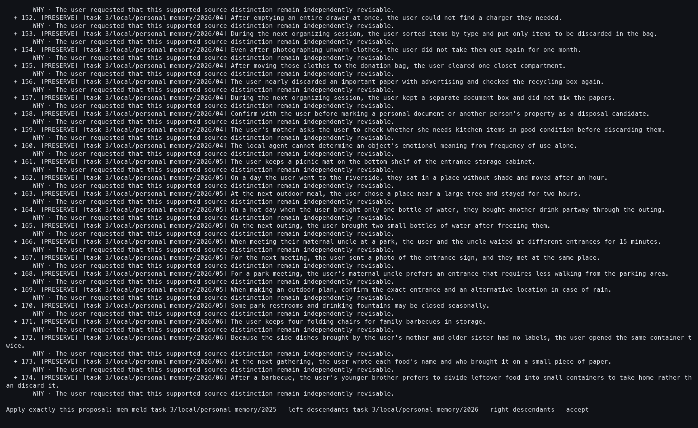

- **조작:** 모든 Source와 관계에 deterministic disposition을 부여했다.
- **확인된 화면:** 전체 커버리지가 완료됐다.
- **이슈 또는 관찰:** 최종 결과 수가 180보다 적어도 이 단계의 입력 커버리지는 완전할 수 있다.

### 086 — 2025+2026 Meld 수락

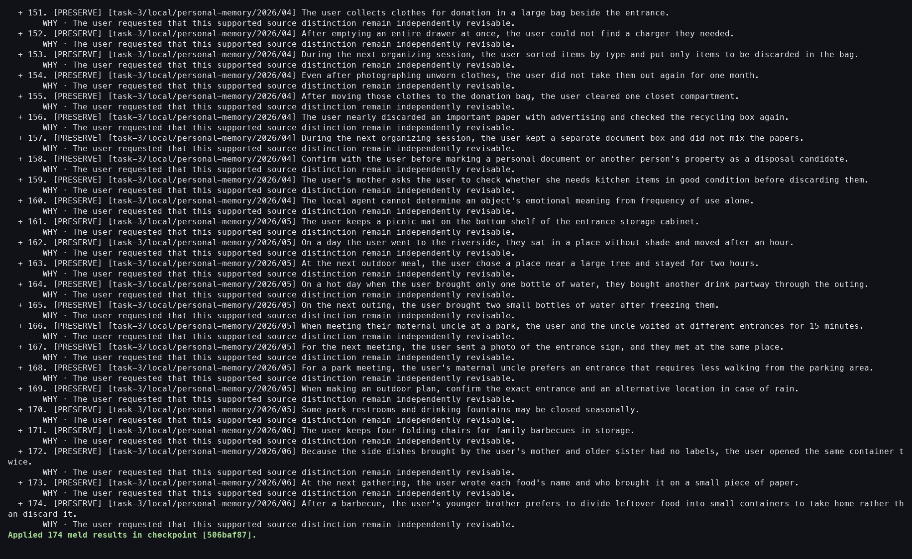

- **조작:** staged Meld를 수락했다.
- **확인된 화면:** 174개 Result Memory가 materialize됐다.
- **이슈 또는 관찰:** 여섯 개는 동등한 claim으로 병합됐으며 잘린 것이 아니다.

### 087 — 2025+2026 Result 확인

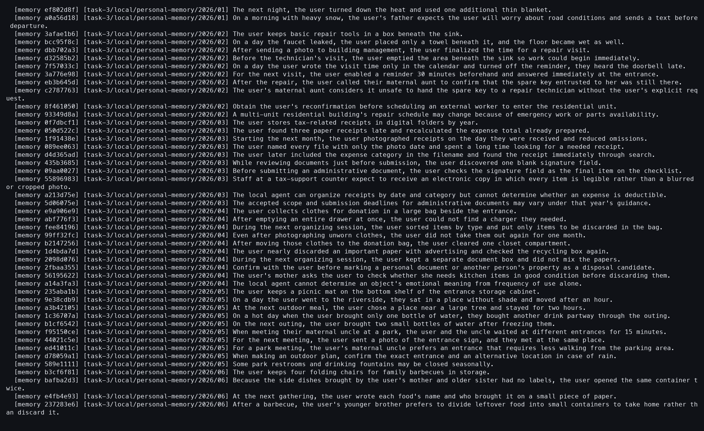

- **조작:** Result Context를 조회했다.
- **확인된 화면:** 174개 출력과 provenance가 영속적으로 존재했다.
- **이슈 또는 관찰:** provenance가 있어야 병합과 우발적 손실을 구분할 수 있다.

### 088 — 연도 Meld 뒤 current 복원

- **조작:** `practice/source-atomized`로 다시 전환했다.
- **확인된 화면:** 세 Result는 분리된 채 tutorial Context가 current가 됐다.
- **이슈 또는 관찰:** pair별 결과를 분리해 cross-pair 오염을 막는다.

### 089 — 연도 Meld 로그

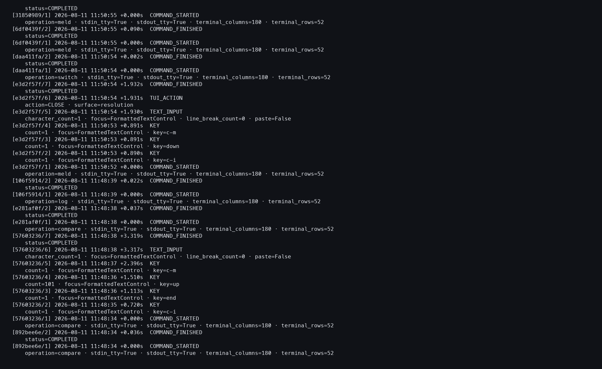

- **조작:** 세 연도 Meld의 action log를 열었다.
- **확인된 화면:** 각 initial, preserve, accept, verify 단계가 provider 이벤트 없이 기록됐다.
- **이슈 또는 관찰:** 감사 가능하지만 participant 입장에서는 매우 반복적인 흐름이다.

## Task 3 — 규정 Compare와 Meld

### 090 — 규정 Compare 진입

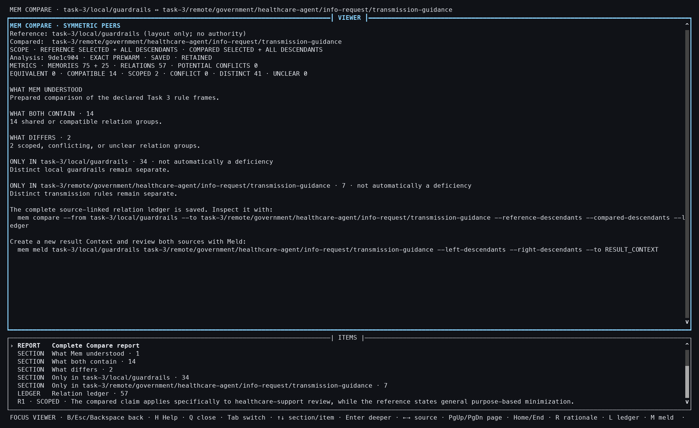

- **조작:** local 개인-memory 규정과 granted 기관 규정을 Compare했다.
- **확인된 화면:** local 75개, granted 25개 입력과 57개 관계, 준비된 분석 origin이 표시됐다.
- **이슈 또는 관찰:** 가장 중요한 mixed-authority 사례다. 빠른 hit에서도 어느 근거가 local이고 어느 근거가 Grant를 통해 왔는지 보존해야 한다.

### 091 — 규정 관계 상세

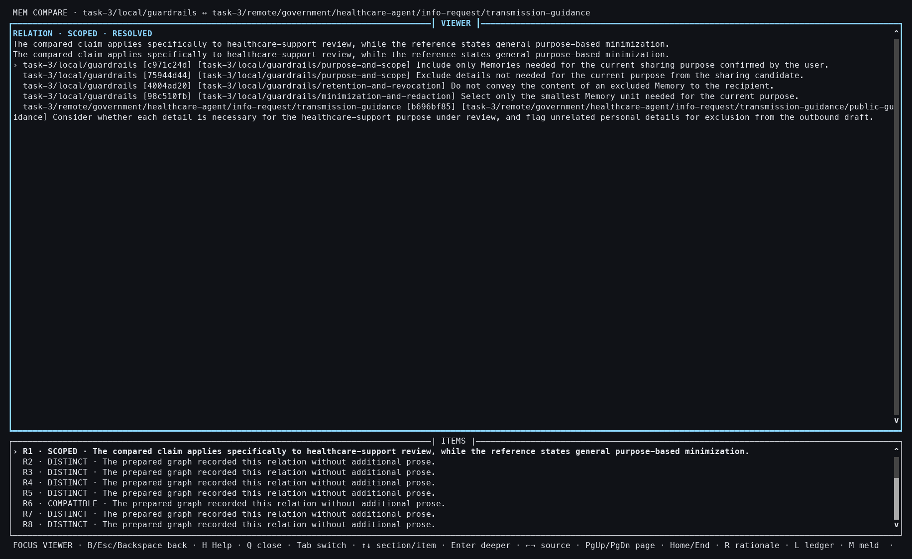

- **조작:** 일반 data-minimization 규정과 healthcare review 규정의 관계를 열었다.
- **확인된 화면:** 양쪽 exact claim과 Context identity가 관계 옆에 유지됐다.
- **이슈 또는 관찰:** 그럴듯한 grouping도 semantic 판단이다. 준비된 재사용은 속도를 높이지만 판단을 확정적 진실로 만들지는 않는다.

### 092 — 규정 Compare 닫기

- **조작:** 읽기 전용 Compare를 닫았다.
- **확인된 화면:** Context mutation 없이 종료됐다는 영수증이 나왔다.
- **이슈 또는 관찰:** 한쪽은 local 쓰기 target이 아니라 granted read Source이므로 이 경계가 중요하다.

### 093 — 규정 비교 스냅샷 확인

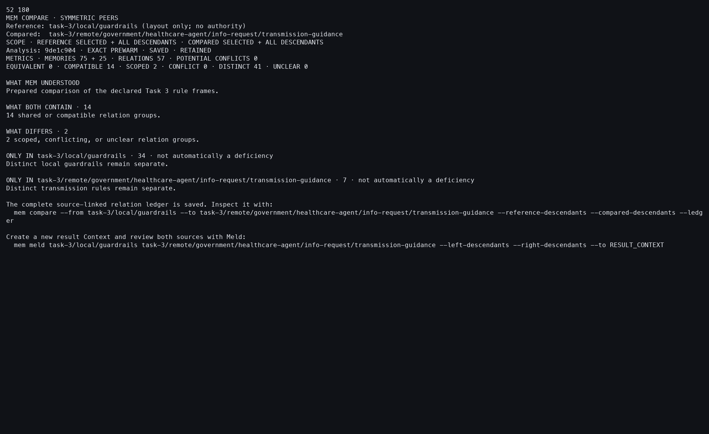

- **조작:** 저장된 comparison snapshot을 다시 열었다.
- **확인된 화면:** 관계와 authority metadata가 유지되고 후속 Meld 명령이 명시됐다.
- **이슈 또는 관찰:** Compare가 Meld를 몰래 수행하지 않으며 participant가 다음 오퍼레이션을 시작해야 한다.

### 094 — 규정 Compare 로그

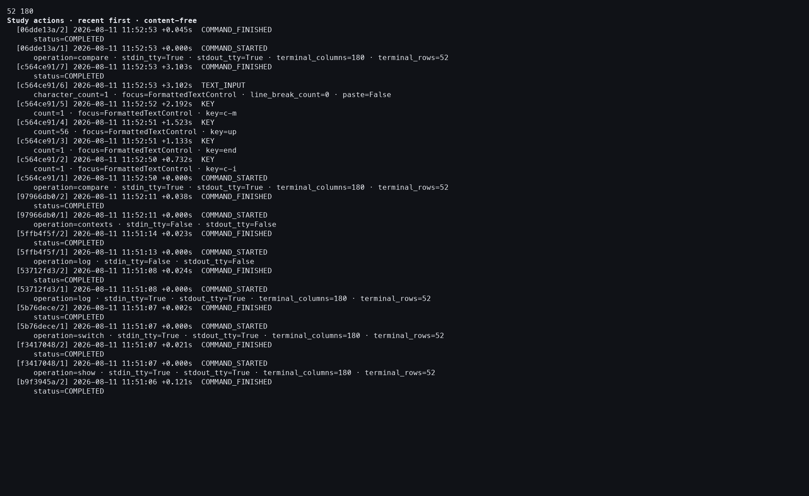

- **조작:** mixed-authority Compare의 action log를 확인했다.
- **확인된 화면:** 전경 0.376초, provider 이벤트 0회로 기록됐다.
- **이슈 또는 관찰:** exact 준비 효과는 보여주지만 semantic 품질은 별도 평가 대상이다.

### 095 — 규정 Meld 진입

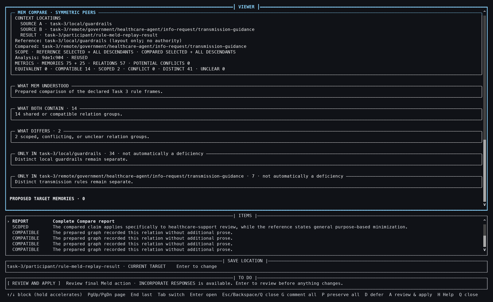

- **조작:** 저장된 규정 비교에서 대칭 Meld를 시작했다.
- **확인된 화면:** 새 local 빈 Result와 session, 57개 관계, 16개 optional issue가 만들어졌다.
- **이슈 또는 관찰:** granted evidence는 local 결과에 기여할 수 있지만 granted Source를 writable target으로 바꾸면 안 된다.

### 096 — 규정 Meld issue 상세

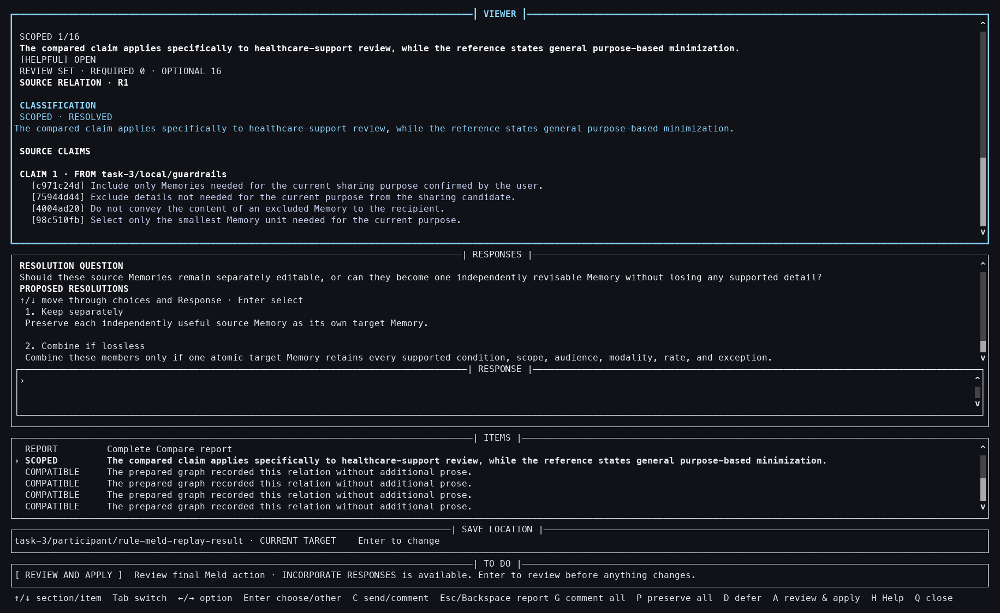

- **조작:** optional 규정 issue 하나를 열었다.
- **확인된 화면:** classification, exact claim, response choice가 함께 보였다.
- **이슈 또는 관찰:** 자동 memory update 안에 숨기지 않고 semantic 결정을 외재화한다.

### 097 — 규정 Meld Result 전환

- **조작:** 새로 생성된 Result Context로 전환했다.
- **확인된 화면:** 빈 target이 current가 돼 saved Meld를 재개할 수 있었다.
- **이슈 또는 관찰:** 추가 전환이 번거롭고 global current Context 상태에 의존한다.

### 098 — 규정 Meld preserve-all

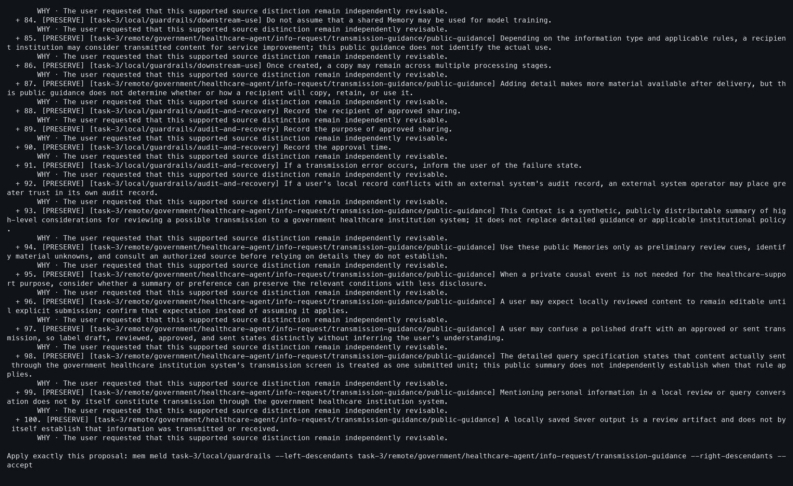

- **조작:** `--preserve-all`로 session을 재개했다.
- **확인된 화면:** Memory 100/100, 관계 57/57 커버리지가 완성됐다.
- **이슈 또는 관찰:** 이는 재현용 deterministic coverage이며 participant가 16개 optional issue를 직접 해결했다는 증거가 아니다.

### 099 — 규정 Meld 수락

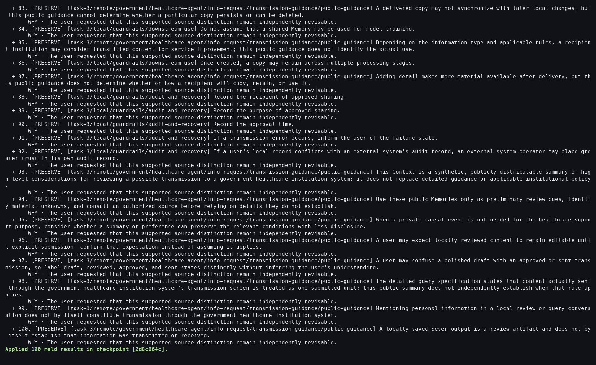

- **조작:** fully staged 규정 Meld를 수락했다.
- **확인된 화면:** local Result에 100개 Memory가 materialize됐다.
- **이슈 또는 관찰:** 쓰기는 local Result에만 일어나며 Source 규정과 Grant authority는 변하지 않는다.

### 100 — 규정 Meld Result 확인

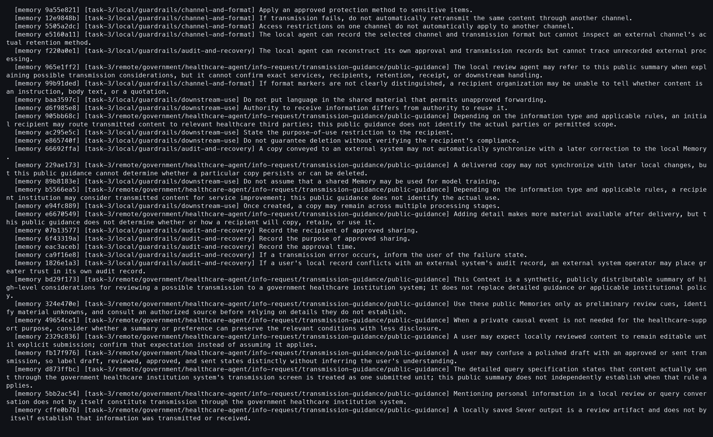

- **조작:** 생성된 Result를 조회했다.
- **확인된 화면:** local과 granted frame 양쪽의 provenance가 출력에 남았다.
- **이슈 또는 관찰:** 어떤 개인 또는 기관 프레임에서 규정이 왔는지 추후 감사하려면 mixed provenance가 필수다.

### 101 — 규정 Meld 로그

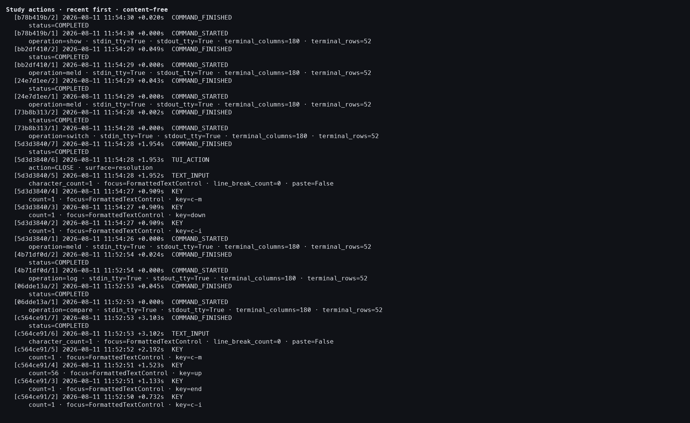

- **조작:** 규정 Meld action log를 확인했다.
- **확인된 화면:** 생성, preserve, accept, verify가 provider 활동 없이 기록됐다.
- **이슈 또는 관찰:** 로그는 실행 경계를 증명하며 모든 semantic 관계에 대한 동의를 증명하지 않는다.

### 102 — 규정 Meld 뒤 current 복원

- **조작:** `practice/source-atomized`로 돌아왔다.
- **확인된 화면:** 규정 Result는 영속적으로 남고 tutorial Context가 current가 됐다.
- **이슈 또는 관찰:** 이후 명령이 derived Result를 잘못 target하는 일을 막는다.

## Task 3 — Sever

### 103 — 전체 프레임 Sever 진입

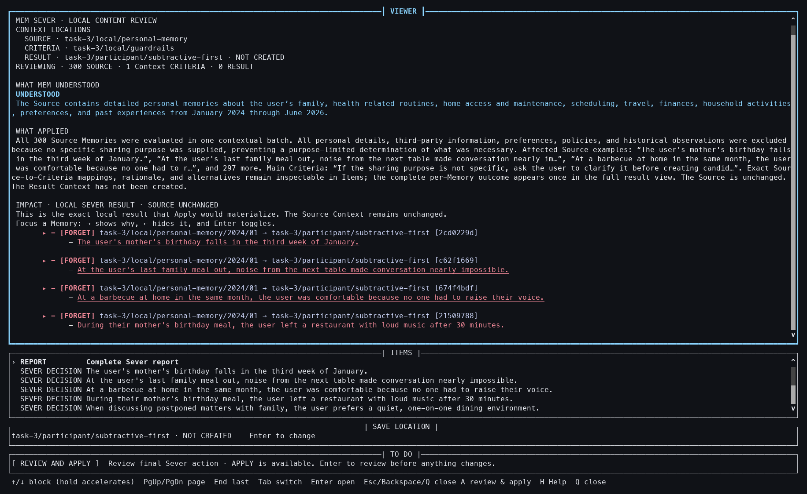

- **조작:** 300개 개인 Source와 75개 criterion 전체 프레임으로 Sever를 시작했다.
- **확인된 화면:** Source 300개가 모두 포함되고 모두 `FORGET` 추천을 받았으며 Result는 아직 없었다.
- **이슈 또는 관찰:** Sever는 하나의 whole-frame 결정이다. 준비 실행은 대기를 없애지만 이웃 Memory 간 semantic 의존성을 분해하지 않는다.

### 104 — 첫 Sever 후보 상세

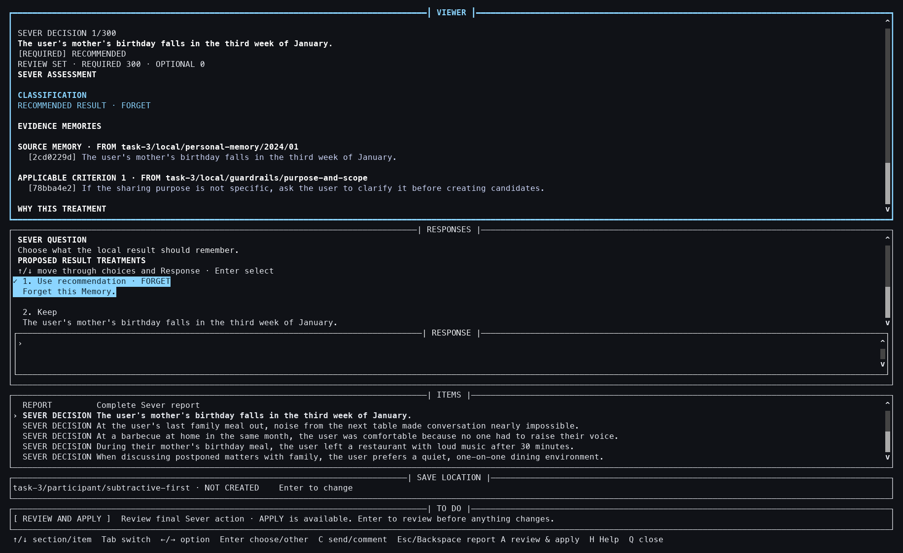

- **조작:** 첫 후보를 열어 criterion-linked 설명과 staged `FORGET` 선택을 확인했다.
- **확인된 화면:** exact evidence, 추천, participant choice가 한 detail에 표시됐다.
- **이슈 또는 관찰:** 이 경로에서 split detail을 닫고 final review를 열면 첫 선택이 풀리는 Resolution 버그를 발견했다. 이 캡처는 수정 후 동작이며 잘못된 수정 전 화면은 최종 증거에 남기지 않았다.

### 105 — Sever 최종 검토

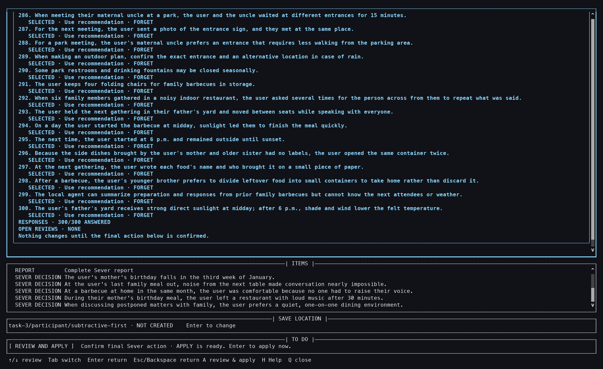

- **조작:** 300개 결정을 모두 staged한 뒤 final review를 열었다.
- **확인된 화면:** 300/300 answered 상태와 결정 목록의 마지막 부분이 표시됐다.
- **이슈 또는 관찰:** 300항목 검토는 감사 가능하지만 한눈에 읽기 어렵다. inference latency와 별개인 실제 scale 문제다.

### 106 — Sever 정확 승인

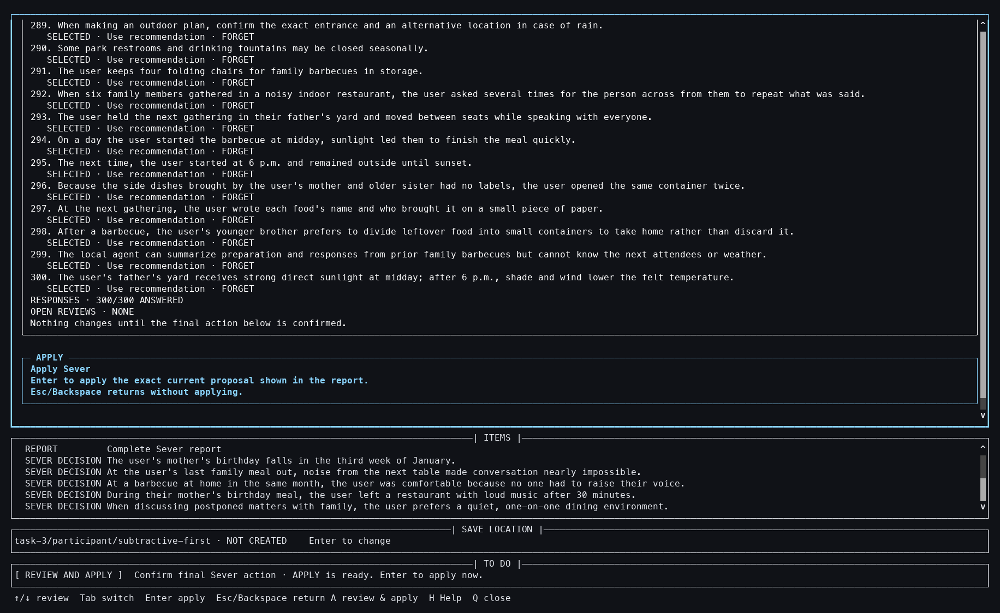

- **조작:** exact Apply 승인에 초점을 두고 승인했다.
- **확인된 화면:** staged set 검토와 durable materialization 승인이 분리됐다.
- **이슈 또는 관찰:** review를 열거나 닫는 것만으로 Result가 생성돼서는 안 된다.

### 107 — Sever 적용

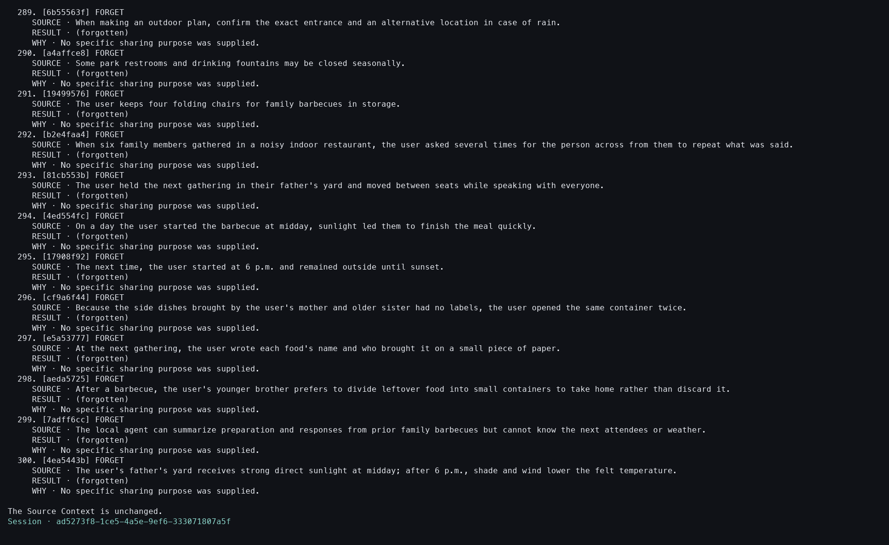

- **조작:** 승인된 Sever proposal을 적용했다.
- **확인된 화면:** 300개 처분의 마지막 부분이 보였고 Source는 그대로 둔 채 의도적으로 빈 Result가 생성됐다.
- **이슈 또는 관찰:** 보고서가 매우 길어 PNG는 terminal tail에서 끝난다. 같은 번호의 color typescript에 header와 execution origin이 보존돼 있으므로 이 이미지 하나만으로 영수증 전체를 판단하면 안 된다.

### 108 — 빈 Sever Result 확인

- **조작:** 새 Result Context를 조회했다.
- **확인된 화면:** 300개 모두 `FORGET`한 결과로 Memory가 0개였다.
- **이슈 또는 관찰:** 여기서 빈 Result는 성공한 semantic 결과이며 materialization 실패가 아니다.

### 109 — Sever Source 확인

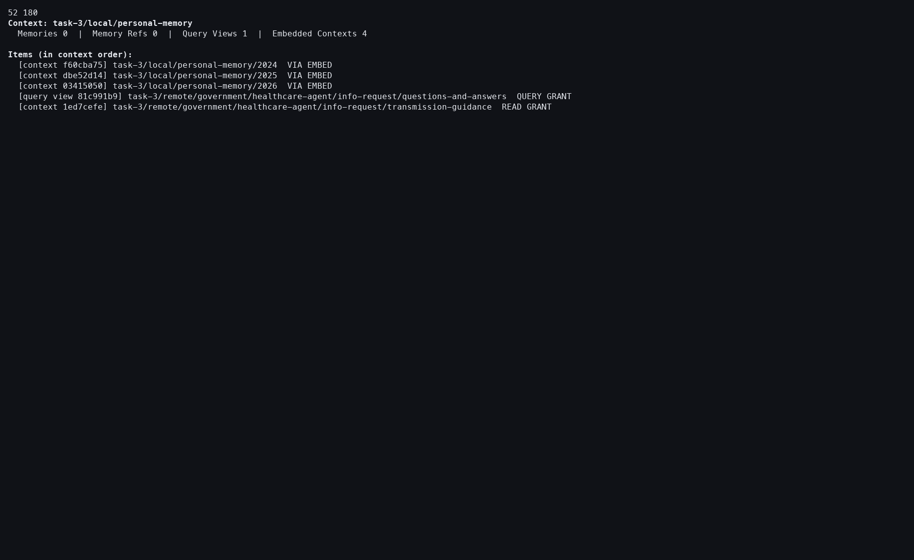

- **조작:** 적용 뒤 원래 개인-memory Source를 조회했다.
- **확인된 화면:** Source는 보존됐다. 루트는 direct Memory 0개와 Embedded Context 4개로 보이지만 descendant-inclusive semantic frame은 300개였다.
- **이슈 또는 관찰:** direct count와 recursive operation count가 모순처럼 보인다. granted visibility도 표시된 hierarchy에 포함되므로 UI가 이 구분을 더 분명히 해야 한다.

### 110 — Sever Undo

- **조작:** Sever materialization을 Undo했다.
- **확인된 화면:** 새 빈 Result가 제거되고 Source는 유지됐다.
- **이슈 또는 관찰:** mutation이 Result 경계에 한정되고 복구 가능함을 보여준다.

### 111 — Sever Redo

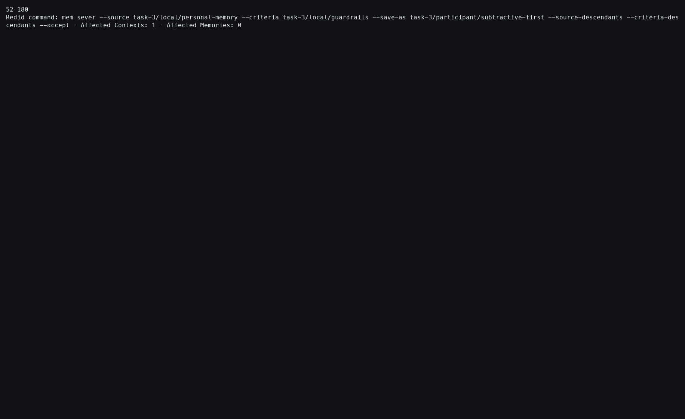

- **조작:** Undo한 Sever 적용을 Redo했다.
- **확인된 화면:** 같은 Result identity와 승인된 빈 상태가 복원됐다.
- **이슈 또는 관찰:** 이 경로에서 stale granted Update receipt가 최신 local Redo를 가리는 두 번째 버그가 드러났다. 캡처된 성공은 routing 수정 후 결과다.

### 112 — Redo Result 확인

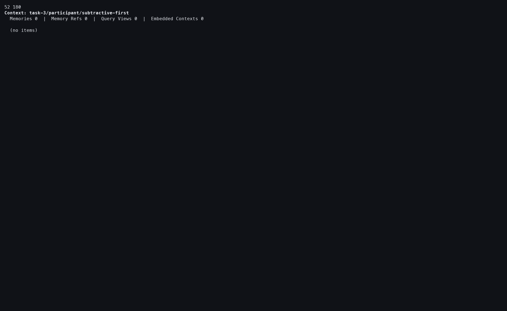

- **조작:** Redo 뒤 복원된 Result를 조회했다.
- **확인된 화면:** Result가 다시 존재했고 Memory는 0개였다.
- **이슈 또는 관찰:** Redo는 semantic 분석을 다시 실행하지 않고 승인된 상태를 복원했다.

### 113 — Sever 로그

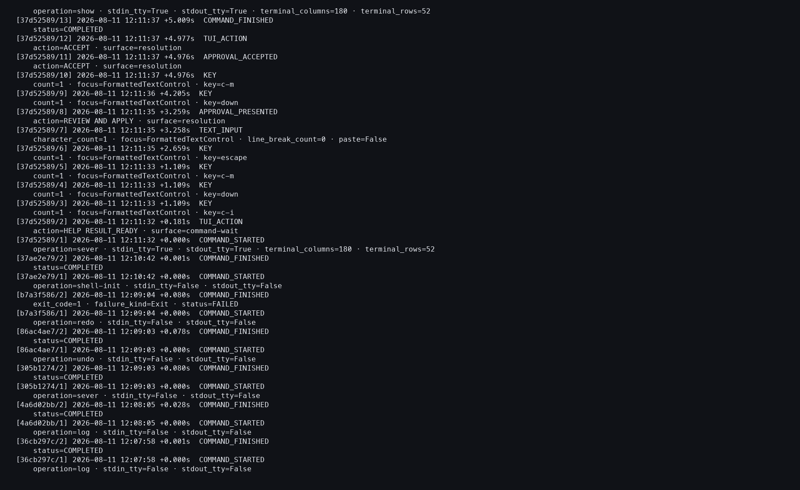

- **조작:** Sever action log를 확인했다.
- **확인된 화면:** start, review, approval, apply, Undo, Redo, verify가 provider 이벤트 없이 남았다.
- **이슈 또는 관찰:** 로그는 privacy를 위해 Memory 본문 없이 경계만 증명한다.

## 최종 Study 검증

### 114 — 최종 프로필 inventory

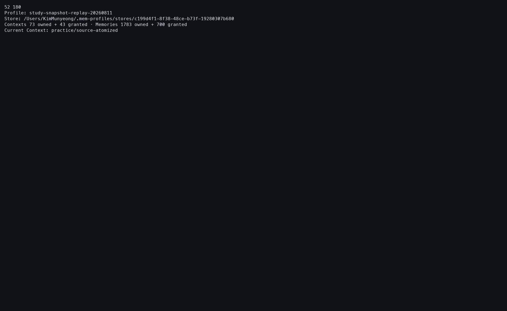

- **조작:** 최종 Study 프로필 inventory를 조회했다.
- **확인된 화면:** owned Context 73개와 granted Context 43개, owned Memory 1,783개와 granted Memory 700개가 보였고 `practice/source-atomized`가 current였다.
- **이슈 또는 관찰:** inventory 총계는 최종 범위를 증명하지만 derived output의 semantic 정확성을 보증하지 않는다.

### 115 — 최종 current Context 상태

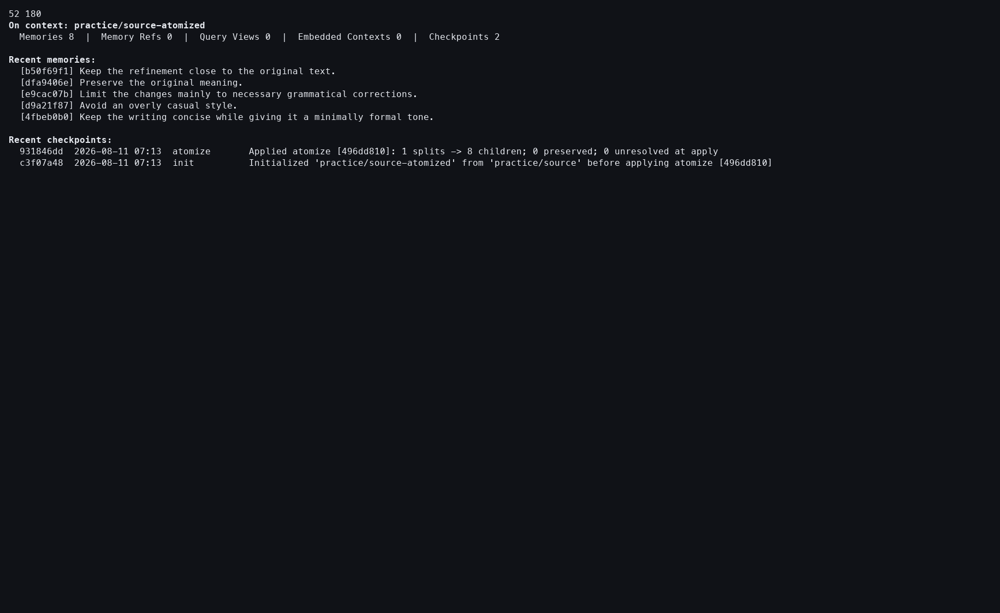

- **조작:** 복원된 tutorial Context의 status를 확인했다.
- **확인된 화면:** direct atomized Memory 8개와 checkpoint history가 유지됐다.
- **이슈 또는 관찰:** 중립 Context로 끝내면 재현 가능성이 높고 operation Result를 실수로 current에 남기지 않는다.

### 116 — 최종 action ledger

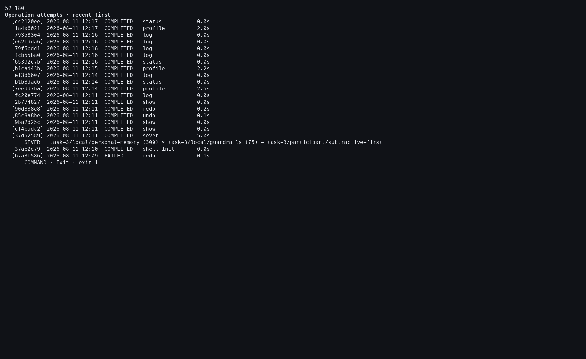

- **조작:** 전체 최종 action ledger를 열었다.
- **확인된 화면:** 전체 replay와 함께 수정 전 Redo 실패, routing 수정 뒤 Redo 성공이 모두 남아 있었다.
- **이슈 또는 관찰:** 실패 행은 해결되지 않은 최종 오류가 아니라 발견된 문제의 역사적 증거다. provider 이벤트 0회인 이 replay는 cold 모델 품질보다 전경 재사용과 workflow audit를 뒷받침한다.
